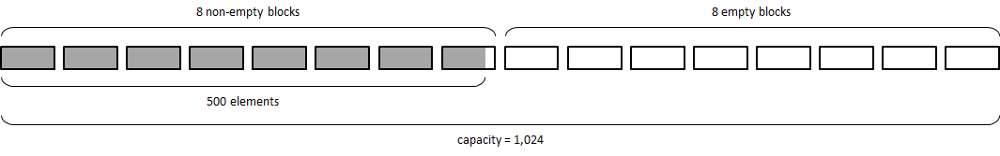
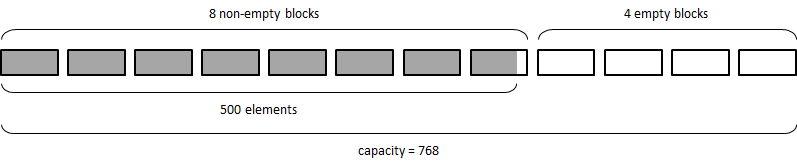
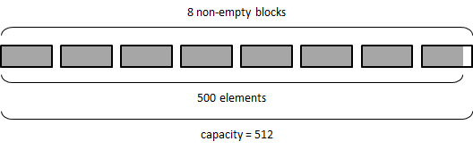
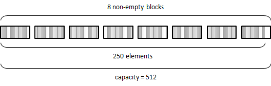
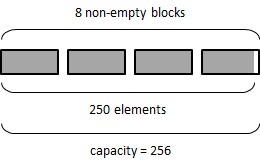
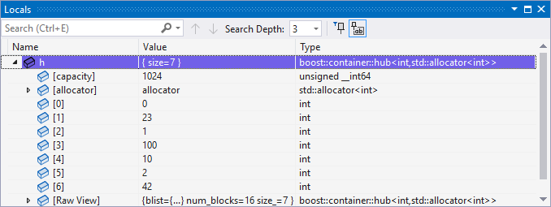
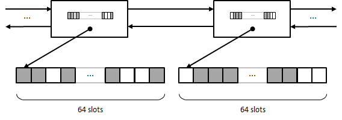

# Hub container

[](https://github.com/joaquintides/hub/tree/develop) [](https://github.com/joaquintides/hub/actions/workflows/ci.yml) [](https://ci.appveyor.com/project/joaquintides/hub) [](https://joaquintides.github.io/hub/develop/gcovr/index.html) <br/>
[](https://www.boost.org/users/license.html)  

`boost::container::hub` (proposed for Boost.Container) is a nearly drop-in replacement
of [`std::hive`](https://eel.is/c++draft/sequences#hive) with a more compact design than
the current reference implementation of this standard container.

* [Introduction](#introduction)
* [Getting started](#getting-started)
* [Tutorial](#tutorial)
  * [Unordered insertion](#unordered-insertion)
  * [Capacity](#capacity)
  * [`std::hive` operations](#stdhive-operations)
  * [Visitation](#visitation)
  * [Debugging](#debugging)
    * [Visual Studio Natvis](#visual-studio-natvis)
    * [GDB Pretty-Printer](#gdb-pretty-printer)
* [Motivation for a novel data structure](#motivation-for-a-novel-data-structure)
* [Deviations from `std::hive`](#deviations-from-stdhive)
* [Performance](#performance)
  * [GCC 15, x64](#gcc-15-x64)
  * [Clang 20, x64](#clang-20-x64)
  * [Clang 17, ARM64](#clang-17-arm64)
  * [VS 2022, x64](#vs-2022-x64)
  * [GCC 15, x86](#gcc-15-x86)
  * [Clang 20, x86](#clang-20-x86)
  * [VS 2022, x86](#vs-2022-x86)
* [Reference](#reference)
  * [`<boost/container/hub.hpp>`](#boostcontainerhubhpp)
  * [Class template `boost::container::hub`](#class-template-boostcontainerhub)
    * [Synopsis](#synopsis)
    * [Description](#description)
    * [Constructors, copy and assignment](#constructors-copy-and-assignment)
    * [Capacity](#ref-capacity)
    * [Modifiers](#modifiers)
    * [`std::hive` operations](#ref-stdhive-operations)
    * [Erasure](#erasure)
    * [Visitation](#ref-visitation)

## Introduction

`boost::container::hub` is a container with constant-time insertion and erasure and _element stability_: 
pointers/iterators to an element remain valid until the element is erased.

```cpp
#include <boost/container/hub.hpp>
#include <cassert>

int main()
{
  boost::container::hub<int> h;

  // Insert some elements and keep an iterator to one of them
  for(int i = 0; i < 100; ++i) h.insert(i);
  auto it = h.insert(100);
  for(int i = 101; i < 200; ++i) h.insert(i);

  // Erase some of the elements
  erase_if(h, [](int x) { return x % 2 != 0;});
  assert(*it = 100); // iterator still valid

  // Insert many more elements
  for(int i = 200; i < 10000; ++i) h.insert(i);
  assert(*it = 100); // iterator still valid
}
```

The observant reader may retort that `std::list` is also stable and provides constant-time insertion/erasure:
the key difference is that `boost::container::hub` is orders of magnitude faster because memory is allocated
in chunks of contiguous elements, which amortizes allocation costs and provides some degree of
cache locality. An important tradeoff when using `boost::container::hub` is the fact that the user can't
control the position where a new element will be inserted: `boost::container::hub` reuses the memory
addresses of previously erased elements to maximize performance and keep the data structure as compact
as possible.

`boost::container::hub` is very similar but not entirely equivalent to C++26
[`std::hive`](https://eel.is/c++draft/sequences#hive) (hence the different naming).
Consult the section ["Deviations from `std::hive`"](#deviations-from-stdhive) for details.

The primary use case for `boost::container::hub`, `std::hive` and similar containers such
as _slot maps_ is in high-performance scenarios where elements are created and destroyed frequently,
insertion order is not relevant and pointer/iterator stability is required: game entity systems,
particle simulation and high-frequency trading come to mind.

## Getting started

`boost::container::hub` depends on Boost. Consult the website [section](https://www.boost.org/doc/user-guide/getting-started.html) on how
to install the entire Boost project or only the exact dependencies of `boost::container::hub`
(`assert`, `config`, `core` and `throw_exception`).

This is a header-only library, so no additional build phase is needed. C++11 or later required.
The library has been verified to work with GCC 4.8, Clang 3.5 and Visual Studio 2017/MSVC 14.1 
(and later versions of those). You can check that your environment is correctly set up by
compiling the example program shown above.

## Tutorial

If you're familiar with STL containers such as `std::list` and `std::vector`,
getting used to `boost::container::hub` is entirely straightforward as its API is
mostly analogous. The key characteristics that set this container apart are:

* Pointers and iterators to an element remain valid as long as the element is not
erased. `hub` will _not_ reallocate elements as it grows in size.
* Insertion and erasure are constant-time and very fast. Memory is allocated in
element blocks with fixed capacity (64 elements per block in this implementation),
and the container keeps track of available positions, including those of erased elements,
to use them for further insertions and keep the number of memory allocations to the
minimum possible.

### Unordered insertion

As a result of its memory reuse policy, users generally can't control the resulting
insertion order in a `hub`:

```cpp
boost::container::hub<int> h = {0, 1, 2};
h.erase(h.begin());
h.insert({3, 4, 5});
for(const auto& x: h) std::cout << x << " ";
```
Output
```
3 1 2 4 5
```

In the example, `h.erase(h.begin())` generates an available position where
`0` used to be, and this is where `3` goes in when inserting `{3, 4, 5}`,
rather than after `2`.

### Capacity

`reserve` can be used to preallocate memory blocks before insertion:

```cpp
boost::container::hub<int> h;
h.reserve(1000); // capacity() is rounded to the next multiple of 64 (1024)
for(int i = 0; i < 500; ++i) h.insert(i); // won't allocate as capacity() >= 500
```

In the example, `h` ends up with 8 non-empty blocks and 8 empty (also called _reserved_)
blocks:

<p align="center"></p>

Empty blocks can be deallocated as follows:

```cpp
h.trim_capacity(750); // capacity() rounded up to next multiple of 64 no less than 750
```

<p align="center"></p>

or with:

```cpp
h.trim_capacity(); // equivalent to trim_capacity(0)
```

<p align="center"></p>

Obviously, in this example `h.trim_capacity()` doesn't bring the capacity down to zero
because the example `h` contains 500 elements.

After erasures, a `hub` may contain "holes" or available positions in
non-empty blocks that can't be trimmed further:

```cpp
erase_if(h, [](int x) { return x % 2 != 0; }); // erase odd values
```

<p align="center"></p>

`shrink_to_fit` reallocates elements so that they occupy the minimum possible
number of blocks, and then deallocates the remaining blocks:

```cpp
h.shrink_to_fit();
```

<p align="center"></p>

If we print the elements of `h`:

```cpp
for(const auto& x: h) std::cout << x << " ";
```
we get:
```
0 126 2 124 4 122 6 120 8 118 10...
```
Note how `shrink_to_fit` has reallocated the elements `126`, `124`, etc. so that
they go in the available positions previously occupied by odd values.

### `std::hive` operations

`boost::container::hub` provides operations specific to C++26 `std::hive`:

```cpp
boost::container::hub<int> h1 = {0, 2, 3, 4, 6},
                           h2 = {1, 4, 6, 7, 9};
h1.splice(h2); // transfer non-empty blocks from h2 to h1 (no reallocation)
h1.sort();     // sorts the values (reallocates)
h1.unique();   // erase repeated, consecutive values
```

A slightly more interesting operation is `get_iterator`:

```cpp
boost::container::hub<int> h;
//...
int* p = std::addressof(*h.insert(50));
//...
boost::container::hub<int>::iterator it = h.get_iterator(p);
h.erase(it); // erase the element (couldn't be done directly with p)
```

`get_iterator` returns an iterator after a pointer to a valid element of the
`hub`. This can be useful in legacy scenarios where elements of the container
are externally tracked via pointers, or for encapsulation purposes, or
to save memory (`hub` iterators typically are 16 bytes in size). Note, however,
that `get_iterator` is not cheap: execution is linear on the number of
non-empty blocks.

### Visitation

The following, typical processing loop:

```cpp
boost::container::hub<int> h;
//...
for(auto& x: h) x *= 2;
```

Can also be written as:
```cpp
// Note this is _not_ std::for_each
for_each(h, [](auto& x) { x *= 2; });
```

Although functionally equivalent to the classical loop, `for_each` is generally
faster as it is implemented with a combination of loop unrolling and prefetching
techniques. Speedups can be as high as 1.75x. Consult the [performance](#performance)
section for a comparison of execution speeds. Consult the
[reference](#ref-visitation) for documentation on variations of
`for_each` (`for_each(first, last, f)`, `for_each_while(h, f)`,
`for_each_while(first, last, f`).

### Debugging
#### Visual Studio Natvis

Add the [`boost_hub.natvis`](extra/boost_hub.natvis) visualizer to your project to allow
for user-friendly inspection of `boost::container::hub`s.

<p align="center"></p>

#### GDB Pretty-Printer

`boost::container::hub` comes with a dedicated 
[pretty-printer](https://sourceware.org/gdb/current/onlinedocs/gdb.html/Pretty-Printing.html#Pretty-Printing)
for visual inspection when debugging with GDB:

```
(gdb) print h
$1 = boost::container::hub with {size = 7, capacity = 1024} = {0, 23, 1, 100, 10, 2, 42}
(gdb) print h[3]
$2 = 100
```

Remember to enable pretty-printing in GDB (typically a one-time setup):

```
(gdb) set print pretty on
```

And load the [`boost_hub_printers.py`](extra/boost_hub_printers.py) script before variable inspection:

```
(gdb) source <path-to-hub-repo>/extra/boost_hub_printers.py
```

## Motivation for a novel data structure

`std::hive` was [accepted into C++26](https://herbsutter.com/2025/02/17/trip-report-february-2025-iso-c-standards-meeting-hagenberg-austria)
in February 2025. As of this writing, no major standard library implementor is providing
this container yet, though the work to do so is ongoing. Matthew Bentley's
[`plf::hive`](https://github.com/mattreecebentley/plf_hive) is the de facto reference
implementation. Two important decisions in the [design of `plf::hive`](https://plflib.org/colony.htm#details)
are:

* As the size of the container grows, newly allocated element blocks get larger up to a
limit specified by the user and capped internally. This is done to increase cache locality
while keeping memory usage reasonable for small containers.
* Efficient iteration and location of available slots are served by a combination
of a [skipfield array](https://plflib.org/matt_bentley_-_the_low_complexity_jump-counting_pattern.pdf)
and a list of erased elements (the latter embedded into the memory of the erased elements
themselves).

This structure requires significant bookkeeping and introduces a minimum memory
overhead of at least one (and typically two) bytes per slot. The question arises of whether
we can come up with a more efficient alternative design.

The internal data structure of `boost::container::hub` is as follows:

<p align="center"></p>

* Active blocks are kept in an intrusive doubly-linked list. Block size
is fixed to 64 elements.
* Each block points to its associated element array and maintains a bitmask
of used slots. The reason why a block size of 64 has been chosen is because
the resulting associated bitmask is a 64-bit word, for which most CPU
architectures provide fast bit manipulation instructions.
* _Available_ blocks (those with at least one free slot) are kept in another
intrusive doubly-linked list (not shown in the diagram).

Blocks then hold five pointers (two intrusive lists plus a pointer to the
element array) and a mask of type `std::uint64_t`, yielding a total overhead of 
6 bits per slot (in 64-bit mode). Locating an occupied (resp. free) slot in a given
block can be effectively accomplished in constant time with
[`std::countr_zero(mask)`](https://en.cppreference.com/w/cpp/numeric/countr_zero.html)
(resp. `std::countr_one(mask)`). It is not hard to see that insertion, erasure and
iterator increment can also be implemented in (non-amortized) constant time.

## Deviations from `std::hive`

`boost::container::hub` does not conform to the specification of `std::hive` in
a few aspects:

* Minimum and maximum block size limits can't be specified and are fixed
(to 64 in this implementation). `reshape` is not provided as it doesn't make sense when
block capacity is fixed.
* `trim_capacity` is linear on the number of _available_ blocks
(`std::hive::trim_capacity` is linear on the number of _reserved_ blocks,
i.e. those without any used slot).
* Iterators are not
[`three_way_comparable`](https://en.cppreference.com/w/cpp/utility/compare/three_way_comparable.html):
Making them so would require extra block metadata and bookkeeping, and this overhead
was not deemed worth imposing over the potential usefulness of having ordered
iterators.
* `get_iterator` is not `noexcept`.
* No operations are marked `constexpr`.

The following functionality is specific to `boost::container::hub`:

* As cache locality is relatively poorer than that of other implementations of `std::hive`
(like `plf::hive`), which can use much larger blocks, iteration performance may suffer.
To partially alleviate this, _visitation_ functions `for_each`,  and
`for_each_while` are provided: these are more performant than regular external
iteration thanks to a combination of unrolling and prefetching techniques.
* `erase_void` is an alternative to `erase` that does not return an iterator
to the next element, thus saving some potential runtime overhead.
* The `end` iterator is stable and non-transferable, whereas for `std::hive`
the `end` iterator is invalidated upon any insertion or the erasure of the last
element (briefly put,
`boost::container::hub::end` behaves like `std::list::end` whereas
`std::hive::end` behaves like `std::vector::end`). Technically, this is
not a non-conformance but rather an extension to the specification of
`std::hive`.

## Performance

Benchmarks of `boost::container::hub` vs. `plf::hive` are run as GitHub Actions jobs in a
[dedicated repo](https://github.com/boostorg/boost_hub_benchmarks). Execution times for
the following scenarios are measured:

* Insertion of _n_ elements in the container, random erasure of elements with
probability _r_ and insertion of elements until the size of the container becomes
_n_ again.
* The above, plus destruction of the container.
* range-based `for` loop traversal of the container after insertion of _n_ elements and
random erasure with probability _r_.
* Visitation-based `for_each` traversal for `boost::container::hub` vs. range `for`
traversal for `plf::hive`.
* Sorting the container after insertion of _n_ elements and
random erasure with probability _r_.

Benchmarks cover all the combinations of

* _n_ = 10<sup>3</sup>, 10<sup>4</sup>, ...,  10<sup>7</sup>,
* _r_ = 0, 0.1,  ..., 0.9,
* `sizeof(element)` = 16, 32, 64, 80.

Values show the relative execution time of `plf::hive` with respect to
`boost::container::hub` (e.g. "1.2" means `boost::container::hub` is 1.2
times faster than `plf::hive`).

### GCC 15, x64
<!--gcc-x64/element_16.txt-->
```
             ----------------------------------------------------------------------------------------------------------------------------------------
             | sizeof(element): 16                                                                                                                  |
             ----------------------------------------------------------------------------------------------------------------------------------------
             | insert, erase, insert    | ins, erase, ins, destroy | range for                | for_each                 | sort                     |
             ----------------------------------------------------------------------------------------------------------------------------------------
             | container size           | container size           | container size           | container size           | container size           |
-----------------------------------------------------------------------------------------------------------------------------------------------------
| erase rate | 1.E3 1.E4 1.E5 1.E6 1.E7 | 1.E3 1.E4 1.E5 1.E6 1.E7 | 1.E3 1.E4 1.E5 1.E6 1.E7 | 1.E3 1.E4 1.E5 1.E6 1.E7 | 1.E3 1.E4 1.E5 1.E6 1.E7 |
-----------------------------------------------------------------------------------------------------------------------------------------------------
| 0          | 1.28 2.43 1.22 1.38 1.47 | 1.28 1.05 1.17 1.37 1.43 | 1.03 1.12 1.03 1.03 1.03 | 1.78 1.96 1.98 1.96 1.76 | 1.00 1.00 1.00 1.00 1.00 |
| 0.1        | 1.25 1.23 1.26 1.83 1.56 | 1.23 1.08 1.22 1.78 1.57 | 1.13 1.04 1.03 1.03 1.03 | 1.70 1.76 1.76 1.76 1.60 | 1.00 0.99 0.99 0.99 0.97 |
| 0.2        | 1.22 1.10 1.32 1.93 1.75 | 1.21 1.10 1.30 1.66 1.57 | 1.07 1.02 1.03 1.02 1.03 | 1.68 1.72 1.73 1.72 1.51 | 0.99 0.98 1.00 0.98 0.97 |
| 0.3        | 1.26 1.16 1.42 2.02 1.93 | 1.26 1.19 1.42 1.69 1.88 | 1.03 1.03 1.01 1.00 1.00 | 1.74 1.71 1.68 1.67 1.40 | 1.00 0.98 1.00 0.97 0.96 |
| 0.4        | 1.38 1.23 1.53 1.74 1.92 | 1.39 1.39 1.49 1.91 2.02 | 1.01 1.01 0.99 0.99 0.97 | 1.86 1.76 1.64 1.61 1.26 | 1.00 0.98 0.99 0.97 0.95 |
| 0.5        | 1.41 1.56 1.63 1.92 2.18 | 1.43 1.37 1.59 2.10 2.08 | 1.10 0.99 0.97 0.97 0.96 | 1.82 1.82 1.62 1.60 1.17 | 0.99 0.98 0.99 0.95 0.95 |
| 0.6        | 1.49 1.75 1.74 1.99 2.39 | 1.53 1.79 1.70 1.96 2.27 | 1.15 1.00 0.96 0.96 0.95 | 1.83 1.92 1.62 1.56 1.07 | 0.97 1.01 0.98 0.94 0.93 |
| 0.7        | 1.54 1.85 1.85 1.95 2.42 | 1.50 1.74 1.81 2.03 2.44 | 1.36 1.12 0.95 0.93 0.85 | 1.86 1.99 1.68 1.51 0.96 | 0.97 1.26 0.97 0.93 0.91 |
| 0.8        | 1.77 1.82 1.97 2.05 2.42 | 1.52 1.72 1.88 1.94 2.49 | 1.42 1.52 1.02 0.90 0.96 | 1.84 2.04 1.45 1.33 0.90 | 0.93 0.96 0.94 0.90 0.87 |
| 0.9        | 1.90 1.80 2.08 2.38 2.58 | 1.83 1.69 1.95 2.27 2.48 | 1.34 1.62 1.07 0.76 0.89 | 1.61 1.80 1.35 1.07 0.97 | 0.85 0.83 0.89 0.81 0.80 |
-----------------------------------------------------------------------------------------------------------------------------------------------------
```
<!--gcc-x64/element_16.txt-->
<!--gcc-x64/element_32.txt-->
```
             ----------------------------------------------------------------------------------------------------------------------------------------
             | sizeof(element): 32                                                                                                                  |
             ----------------------------------------------------------------------------------------------------------------------------------------
             | insert, erase, insert    | ins, erase, ins, destroy | range for                | for_each                 | sort                     |
             ----------------------------------------------------------------------------------------------------------------------------------------
             | container size           | container size           | container size           | container size           | container size           |
-----------------------------------------------------------------------------------------------------------------------------------------------------
| erase rate | 1.E3 1.E4 1.E5 1.E6 1.E7 | 1.E3 1.E4 1.E5 1.E6 1.E7 | 1.E3 1.E4 1.E5 1.E6 1.E7 | 1.E3 1.E4 1.E5 1.E6 1.E7 | 1.E3 1.E4 1.E5 1.E6 1.E7 |
-----------------------------------------------------------------------------------------------------------------------------------------------------
| 0          | 1.04 2.27 1.87 2.04 1.52 | 1.02 0.98 0.99 2.52 1.55 | 1.07 1.04 1.03 1.01 0.96 | 1.84 1.98 1.95 1.28 1.19 | 1.04 0.99 0.99 1.56 2.03 |
| 0.1        | 1.04 1.04 1.10 2.03 1.62 | 1.02 1.01 1.05 2.14 1.67 | 1.08 1.06 1.03 1.02 0.97 | 1.53 1.74 1.73 1.33 1.11 | 1.03 0.98 0.99 1.49 1.93 |
| 0.2        | 1.05 1.06 1.17 2.14 1.71 | 1.03 1.01 1.12 2.30 1.83 | 1.10 1.03 1.03 0.97 0.95 | 1.73 1.74 1.70 1.20 1.12 | 1.03 0.97 0.99 1.50 1.87 |
| 0.3        | 1.06 1.10 1.25 2.07 1.93 | 1.05 1.07 1.20 2.32 1.96 | 1.07 1.06 1.02 0.99 0.93 | 1.80 1.74 1.69 1.12 1.03 | 1.03 0.97 0.99 1.42 1.81 |
| 0.4        | 1.16 1.19 1.32 2.29 2.13 | 1.15 1.17 1.28 2.30 2.10 | 1.05 1.04 1.02 0.97 0.93 | 1.92 1.82 1.66 1.08 1.01 | 1.04 0.96 0.99 1.40 1.73 |
| 0.5        | 1.15 1.19 1.41 2.28 2.19 | 1.20 1.18 1.36 2.52 2.24 | 1.24 1.03 1.02 1.01 0.90 | 1.93 1.93 1.60 1.12 0.94 | 1.01 0.96 0.99 1.19 1.65 |
| 0.6        | 1.25 1.54 1.52 2.25 2.31 | 1.27 1.50 1.46 2.30 2.31 | 1.25 1.05 1.02 0.93 0.90 | 2.00 1.96 1.52 1.09 0.89 | 1.03 0.96 0.98 1.06 1.61 |
| 0.7        | 1.41 1.60 1.62 2.34 2.33 | 1.36 1.50 1.56 2.22 2.40 | 1.47 1.18 0.99 0.93 0.94 | 2.05 1.86 1.29 1.03 0.85 | 0.97 1.52 0.98 1.09 1.60 |
| 0.8        | 1.48 1.68 1.75 2.50 2.44 | 1.45 1.56 1.68 2.55 2.41 | 1.43 1.48 0.97 0.71 0.89 | 1.87 1.84 1.36 1.61 0.97 | 0.92 1.01 0.96 0.86 1.44 |
| 0.9        | 1.55 1.63 1.84 2.39 2.49 | 1.55 1.53 1.77 2.49 2.58 | 1.39 1.63 1.08 0.75 0.84 | 1.61 2.07 1.36 1.09 0.93 | 0.78 0.78 0.90 0.84 1.11 |
-----------------------------------------------------------------------------------------------------------------------------------------------------
```
<!--gcc-x64/element_32.txt-->
<!--gcc-x64/element_64.txt-->
```
             ----------------------------------------------------------------------------------------------------------------------------------------
             | sizeof(element): 64                                                                                                                  |
             ----------------------------------------------------------------------------------------------------------------------------------------
             | insert, erase, insert    | ins, erase, ins, destroy | range for                | for_each                 | sort                     |
             ----------------------------------------------------------------------------------------------------------------------------------------
             | container size           | container size           | container size           | container size           | container size           |
-----------------------------------------------------------------------------------------------------------------------------------------------------
| erase rate | 1.E3 1.E4 1.E5 1.E6 1.E7 | 1.E3 1.E4 1.E5 1.E6 1.E7 | 1.E3 1.E4 1.E5 1.E6 1.E7 | 1.E3 1.E4 1.E5 1.E6 1.E7 | 1.E3 1.E4 1.E5 1.E6 1.E7 |
-----------------------------------------------------------------------------------------------------------------------------------------------------
| 0          | 1.04 3.12 3.10 2.72 1.91 | 1.02 0.97 0.98 2.63 1.93 | 1.07 1.04 1.04 0.95 0.92 | 1.85 1.75 1.70 1.02 1.01 | 1.03 0.98 1.00 1.56 1.86 |
| 0.1        | 1.04 1.04 1.10 2.52 1.85 | 1.02 0.99 1.05 2.33 1.88 | 1.12 1.09 1.08 0.93 0.94 | 1.88 1.61 1.73 0.98 0.94 | 1.03 0.98 1.00 1.46 1.75 |
| 0.2        | 1.04 1.07 1.18 2.67 2.01 | 0.99 1.02 1.13 2.50 1.99 | 1.15 1.07 1.07 0.95 0.92 | 1.84 1.56 1.51 0.97 0.92 | 1.03 0.99 0.99 1.27 1.66 |
| 0.3        | 1.06 1.12 1.25 2.57 2.20 | 1.04 1.08 1.21 2.71 2.11 | 1.16 1.10 1.06 0.86 0.90 | 1.81 1.48 1.46 0.99 0.92 | 1.02 0.99 0.99 1.20 1.59 |
| 0.4        | 1.11 1.21 1.31 2.46 2.16 | 1.10 1.16 1.29 2.57 2.14 | 1.15 1.06 1.03 0.92 0.93 | 1.85 1.37 1.28 0.96 0.93 | 1.03 0.98 0.99 1.23 1.57 |
| 0.5        | 1.14 1.37 1.38 2.45 2.34 | 1.15 1.21 1.36 2.52 2.37 | 1.29 1.04 0.98 0.85 0.92 | 1.82 1.37 1.19 0.98 0.95 | 1.01 0.99 0.98 1.06 1.47 |
| 0.6        | 1.19 1.50 1.48 2.46 2.26 | 1.20 1.45 1.44 2.61 2.33 | 1.34 1.02 0.97 0.85 0.94 | 1.81 1.66 1.17 0.96 1.02 | 1.01 1.04 0.98 0.99 1.39 |
| 0.7        | 1.24 1.57 1.57 2.55 2.31 | 1.22 1.54 1.54 2.75 2.42 | 1.39 1.24 0.93 0.87 0.91 | 1.99 1.88 1.35 1.09 1.05 | 0.98 1.54 0.95 1.11 1.38 |
| 0.8        | 1.29 1.62 1.67 2.66 2.49 | 1.24 1.54 1.63 2.81 2.52 | 1.43 1.50 0.94 0.93 0.92 | 1.88 2.03 1.44 1.25 1.00 | 0.95 1.02 0.95 0.77 1.27 |
| 0.9        | 1.32 1.60 1.74 2.73 2.48 | 1.49 1.51 1.73 2.79 2.61 | 1.38 1.61 1.11 0.79 0.89 | 1.62 2.16 1.46 1.11 1.00 | 0.72 0.78 0.86 0.95 1.04 |
-----------------------------------------------------------------------------------------------------------------------------------------------------
```
<!--gcc-x64/element_64.txt-->
<!--gcc-x64/element_80.txt-->
```
             ----------------------------------------------------------------------------------------------------------------------------------------
             | sizeof(element): 80                                                                                                                  |
             ----------------------------------------------------------------------------------------------------------------------------------------
             | insert, erase, insert    | ins, erase, ins, destroy | range for                | for_each                 | sort                     |
             ----------------------------------------------------------------------------------------------------------------------------------------
             | container size           | container size           | container size           | container size           | container size           |
-----------------------------------------------------------------------------------------------------------------------------------------------------
| erase rate | 1.E3 1.E4 1.E5 1.E6 1.E7 | 1.E3 1.E4 1.E5 1.E6 1.E7 | 1.E3 1.E4 1.E5 1.E6 1.E7 | 1.E3 1.E4 1.E5 1.E6 1.E7 | 1.E3 1.E4 1.E5 1.E6 1.E7 |
-----------------------------------------------------------------------------------------------------------------------------------------------------
| 0          | 1.09 3.55 3.39 2.85 2.13 | 1.06 1.00 1.02 3.48 2.29 | 1.05 1.01 0.99 0.90 0.87 | 1.45 1.27 1.20 0.93 0.94 | 1.00 0.99 1.00 1.40 1.78 |
| 0.1        | 1.06 1.06 1.12 2.79 2.07 | 1.03 1.00 1.07 2.97 2.15 | 1.07 1.05 1.01 0.86 0.91 | 1.43 1.14 1.07 0.95 0.90 | 1.00 0.96 0.99 1.32 1.66 |
| 0.2        | 1.07 1.09 1.19 2.77 1.98 | 1.03 1.03 1.13 3.02 2.35 | 1.09 1.02 0.99 0.91 0.89 | 1.36 1.06 1.02 0.91 0.85 | 1.01 0.97 0.98 1.43 1.63 |
| 0.3        | 1.07 1.16 1.26 2.81 2.41 | 1.05 1.07 1.20 3.03 2.55 | 1.08 1.05 1.00 0.91 0.90 | 1.48 1.22 1.09 0.93 0.84 | 1.00 0.97 0.97 1.53 1.56 |
| 0.4        | 1.12 1.20 1.33 2.79 2.45 | 1.11 1.14 1.27 3.07 2.62 | 1.07 1.02 0.97 0.92 0.93 | 1.47 1.11 1.01 0.91 0.91 | 1.00 0.98 0.98 1.11 1.47 |
| 0.5        | 1.14 1.44 1.40 2.90 2.55 | 1.12 1.36 1.35 2.92 2.61 | 1.20 0.95 0.94 0.96 0.96 | 1.49 1.16 1.04 1.04 0.94 | 0.99 0.98 0.99 1.05 1.35 |
| 0.6        | 1.19 1.53 1.50 2.95 2.51 | 1.19 1.43 1.44 3.07 2.65 | 1.23 1.05 0.94 0.89 0.95 | 1.54 1.43 1.14 0.92 0.97 | 0.99 1.03 0.98 1.06 1.29 |
| 0.7        | 1.25 1.60 1.61 2.72 2.60 | 1.21 1.49 1.53 2.97 2.76 | 1.30 1.09 0.96 0.90 0.94 | 1.55 1.48 1.12 0.89 0.95 | 0.97 1.51 0.95 0.78 1.20 |
| 0.8        | 1.28 1.56 1.71 2.91 2.78 | 1.24 1.51 1.61 3.22 2.80 | 1.38 1.43 0.90 0.76 0.86 | 1.57 1.76 1.15 1.23 0.92 | 0.93 1.00 0.93 0.71 1.03 |
| 0.9        | 1.31 1.60 1.77 2.81 2.68 | 1.29 1.53 1.68 3.22 2.73 | 1.30 1.60 1.06 0.82 0.87 | 1.43 1.93 1.14 0.88 0.89 | 0.77 0.80 0.89 0.83 0.88 |
-----------------------------------------------------------------------------------------------------------------------------------------------------
```
<!--gcc-x64/element_80.txt-->

### Clang 20, x64
<!--clang-x64/element_16.txt-->
```
             ----------------------------------------------------------------------------------------------------------------------------------------
             | sizeof(element): 16                                                                                                                  |
             ----------------------------------------------------------------------------------------------------------------------------------------
             | insert, erase, insert    | ins, erase, ins, destroy | range for                | for_each                 | sort                     |
             ----------------------------------------------------------------------------------------------------------------------------------------
             | container size           | container size           | container size           | container size           | container size           |
-----------------------------------------------------------------------------------------------------------------------------------------------------
| erase rate | 1.E3 1.E4 1.E5 1.E6 1.E7 | 1.E3 1.E4 1.E5 1.E6 1.E7 | 1.E3 1.E4 1.E5 1.E6 1.E7 | 1.E3 1.E4 1.E5 1.E6 1.E7 | 1.E3 1.E4 1.E5 1.E6 1.E7 |
-----------------------------------------------------------------------------------------------------------------------------------------------------
| 0          | 1.56 2.85 1.40 1.49 1.77 | 1.69 1.59 1.54 1.65 1.80 | 1.92 2.07 2.07 2.06 2.07 | 2.24 2.39 2.39 2.27 2.21 | 1.05 1.03 1.02 1.01 1.00 |
| 0.1        | 1.59 1.46 1.44 2.05 1.74 | 1.72 1.61 1.57 2.16 1.71 | 1.98 2.00 1.80 1.79 1.78 | 2.26 2.40 2.26 2.03 1.92 | 1.04 1.02 1.00 0.98 0.96 |
| 0.2        | 1.68 1.54 1.58 2.50 2.05 | 1.77 1.65 1.69 2.42 2.06 | 1.97 2.02 1.79 1.74 1.75 | 2.24 2.43 2.28 2.00 1.87 | 1.04 1.28 1.00 0.98 0.95 |
| 0.3        | 1.74 1.64 1.70 2.72 2.27 | 1.84 1.75 1.78 2.69 2.20 | 1.98 2.10 1.79 1.66 1.67 | 2.27 2.46 2.32 1.97 1.78 | 1.03 1.14 1.00 0.98 0.95 |
| 0.4        | 1.81 1.72 1.85 3.01 2.48 | 1.90 1.82 1.93 3.01 2.43 | 1.94 2.12 1.83 1.60 1.57 | 2.19 2.50 2.44 1.93 1.71 | 1.03 0.97 0.99 0.97 0.94 |
| 0.5        | 2.19 1.34 2.05 3.22 2.68 | 1.98 1.88 2.08 2.97 2.57 | 1.91 2.16 1.91 1.54 1.46 | 2.28 2.50 2.52 1.88 1.60 | 1.02 0.99 0.99 0.97 0.93 |
| 0.6        | 2.43 1.80 2.26 3.54 2.81 | 2.04 1.95 2.25 3.14 2.62 | 1.94 2.16 2.11 1.56 1.38 | 2.29 2.61 2.53 1.82 1.42 | 0.99 0.98 0.98 0.96 0.91 |
| 0.7        | 2.27 1.97 2.42 3.49 2.80 | 2.13 2.06 2.42 3.46 2.71 | 1.93 2.14 2.04 1.47 1.36 | 2.28 2.71 2.25 1.74 1.18 | 0.99 0.98 0.97 0.94 0.89 |
| 0.8        | 2.15 1.49 2.57 3.31 2.85 | 2.19 2.10 2.57 3.60 2.80 | 1.88 2.16 1.71 1.31 1.12 | 2.33 2.63 1.89 1.53 0.78 | 0.90 0.94 0.95 0.91 0.85 |
| 0.9        | 2.16 2.16 2.75 3.10 2.84 | 2.26 2.18 2.72 3.26 2.76 | 1.69 2.09 1.51 1.11 0.81 | 2.01 2.11 1.98 1.56 0.97 | 0.79 0.84 0.89 0.81 0.73 |
-----------------------------------------------------------------------------------------------------------------------------------------------------
```
<!--clang-x64/element_16.txt-->
<!--clang-x64/element_32.txt-->
```
             ----------------------------------------------------------------------------------------------------------------------------------------
             | sizeof(element): 32                                                                                                                  |
             ----------------------------------------------------------------------------------------------------------------------------------------
             | insert, erase, insert    | ins, erase, ins, destroy | range for                | for_each                 | sort                     |
             ----------------------------------------------------------------------------------------------------------------------------------------
             | container size           | container size           | container size           | container size           | container size           |
-----------------------------------------------------------------------------------------------------------------------------------------------------
| erase rate | 1.E3 1.E4 1.E5 1.E6 1.E7 | 1.E3 1.E4 1.E5 1.E6 1.E7 | 1.E3 1.E4 1.E5 1.E6 1.E7 | 1.E3 1.E4 1.E5 1.E6 1.E7 | 1.E3 1.E4 1.E5 1.E6 1.E7 |
-----------------------------------------------------------------------------------------------------------------------------------------------------
| 0          | 1.64 3.80 3.99 2.45 2.13 | 1.67 1.16 1.55 2.80 2.17 | 2.04 2.07 2.05 1.82 1.72 | 2.28 2.39 2.37 1.98 1.98 | 1.11 1.03 1.01 2.16 2.51 |
| 0.1        | 1.66 1.58 1.61 3.03 1.99 | 1.68 1.35 1.60 2.58 1.95 | 2.02 1.93 1.77 1.40 1.39 | 2.32 2.41 2.24 1.75 1.77 | 1.10 1.01 1.01 1.95 2.39 |
| 0.2        | 1.77 1.62 1.84 3.79 2.29 | 1.76 1.41 1.78 3.07 2.29 | 2.03 1.99 1.76 1.35 1.28 | 2.28 2.43 2.26 1.61 1.48 | 1.10 1.00 1.01 1.82 2.29 |
| 0.3        | 2.21 1.72 1.96 4.07 2.43 | 1.87 1.51 1.91 3.89 2.38 | 1.99 2.05 1.77 1.25 1.25 | 2.33 2.44 2.22 1.55 1.41 | 1.10 1.27 1.01 1.74 2.17 |
| 0.4        | 2.14 1.81 2.05 4.15 2.71 | 1.93 1.50 2.02 4.03 2.67 | 1.94 2.08 1.75 1.36 1.26 | 2.28 2.47 2.25 1.36 1.22 | 1.11 1.07 1.01 1.57 2.05 |
| 0.5        | 2.00 1.92 2.21 3.39 2.79 | 2.01 1.42 2.13 4.17 2.77 | 1.96 2.09 1.73 1.45 1.22 | 2.36 2.51 2.07 1.27 1.16 | 1.09 1.07 1.00 1.52 1.98 |
| 0.6        | 2.07 1.61 2.38 3.74 2.87 | 2.06 1.50 2.29 4.15 2.82 | 2.04 2.10 1.71 1.13 1.12 | 2.46 2.53 1.83 1.03 0.96 | 1.10 1.05 1.00 1.37 1.91 |
| 0.7        | 2.22 1.66 2.58 4.20 2.86 | 2.15 1.78 2.48 4.27 2.83 | 1.98 2.06 1.48 0.99 1.00 | 2.58 2.50 1.68 0.97 0.86 | 1.05 1.05 0.99 1.21 1.85 |
| 0.8        | 2.16 1.72 2.80 4.05 2.89 | 2.21 1.62 2.65 4.03 2.92 | 1.88 1.99 1.43 1.37 0.98 | 2.33 2.43 1.64 1.92 1.05 | 1.01 1.03 0.97 1.15 1.77 |
| 0.9        | 2.21 1.81 2.96 4.00 3.02 | 2.27 1.90 2.75 3.71 2.93 | 1.60 1.93 1.65 1.03 0.93 | 2.07 2.23 2.04 1.61 1.05 | 0.88 0.93 0.92 0.84 1.44 |
-----------------------------------------------------------------------------------------------------------------------------------------------------
```
<!--clang-x64/element_32.txt-->
<!--clang-x64/element_64.txt-->
```
             ----------------------------------------------------------------------------------------------------------------------------------------
             | sizeof(element): 64                                                                                                                  |
             ----------------------------------------------------------------------------------------------------------------------------------------
             | insert, erase, insert    | ins, erase, ins, destroy | range for                | for_each                 | sort                     |
             ----------------------------------------------------------------------------------------------------------------------------------------
             | container size           | container size           | container size           | container size           | container size           |
-----------------------------------------------------------------------------------------------------------------------------------------------------
| erase rate | 1.E3 1.E4 1.E5 1.E6 1.E7 | 1.E3 1.E4 1.E5 1.E6 1.E7 | 1.E3 1.E4 1.E5 1.E6 1.E7 | 1.E3 1.E4 1.E5 1.E6 1.E7 | 1.E3 1.E4 1.E5 1.E6 1.E7 |
-----------------------------------------------------------------------------------------------------------------------------------------------------
| 0          | 1.84 5.48 4.85 3.70 2.86 | 1.73 1.31 1.55 1.58 2.56 | 1.99 2.04 1.97 1.14 1.07 | 2.21 2.37 2.02 0.92 0.87 | 1.01 1.01 1.02 2.44 2.57 |
| 0.1        | 1.90 1.73 1.68 3.06 2.41 | 1.71 1.65 1.60 1.73 2.23 | 1.99 1.96 1.74 1.12 1.00 | 2.28 2.41 1.89 1.08 0.91 | 1.02 1.00 1.01 2.26 2.34 |
| 0.2        | 2.03 2.03 1.90 3.74 2.68 | 1.77 1.73 1.78 2.14 2.51 | 1.99 1.98 1.73 1.10 1.00 | 2.29 2.43 1.78 0.90 0.99 | 1.02 1.02 1.01 2.19 2.20 |
| 0.3        | 2.19 2.15 2.08 3.79 2.82 | 1.93 1.79 1.91 2.50 2.69 | 1.96 2.01 1.69 0.97 0.96 | 2.22 2.40 1.69 0.91 0.97 | 1.03 1.17 1.00 1.66 2.04 |
| 0.4        | 2.31 1.75 2.19 3.67 2.86 | 1.95 1.81 2.04 2.58 2.66 | 1.90 2.01 1.49 0.88 0.91 | 2.19 2.37 1.56 0.81 0.87 | 1.04 1.00 1.04 1.89 1.99 |
| 0.5        | 2.28 2.27 2.39 3.61 2.91 | 2.06 1.64 2.18 2.57 2.60 | 1.86 2.01 1.36 0.99 0.94 | 2.18 2.36 1.49 1.03 0.96 | 1.02 1.00 1.05 1.57 1.90 |
| 0.6        | 2.39 2.39 2.53 3.58 2.90 | 2.15 2.03 2.34 2.61 2.57 | 1.90 2.02 1.33 0.94 0.99 | 2.26 2.34 1.46 1.05 1.10 | 1.02 0.99 0.99 1.61 1.76 |
| 0.7        | 2.42 2.21 2.72 3.51 2.84 | 2.22 1.73 2.51 2.59 2.60 | 1.95 2.03 1.38 1.00 1.02 | 2.34 2.33 1.49 1.10 1.12 | 1.03 1.00 0.99 1.33 1.72 |
| 0.8        | 2.58 2.52 2.87 2.88 2.74 | 2.30 2.09 2.64 2.65 2.61 | 1.97 2.13 1.53 1.04 1.01 | 2.34 2.45 1.70 1.21 1.09 | 0.99 0.95 0.96 1.09 1.51 |
| 0.9        | 2.52 2.62 2.98 2.79 2.77 | 2.30 2.01 2.80 2.58 2.54 | 1.68 2.13 1.68 1.24 0.90 | 2.08 2.50 2.10 1.77 1.03 | 0.87 0.89 0.90 0.99 1.28 |
-----------------------------------------------------------------------------------------------------------------------------------------------------
```
<!--clang-x64/element_64.txt-->
<!--clang-x64/element_80.txt-->
```
             ----------------------------------------------------------------------------------------------------------------------------------------
             | sizeof(element): 80                                                                                                                  |
             ----------------------------------------------------------------------------------------------------------------------------------------
             | insert, erase, insert    | ins, erase, ins, destroy | range for                | for_each                 | sort                     |
             ----------------------------------------------------------------------------------------------------------------------------------------
             | container size           | container size           | container size           | container size           | container size           |
-----------------------------------------------------------------------------------------------------------------------------------------------------
| erase rate | 1.E3 1.E4 1.E5 1.E6 1.E7 | 1.E3 1.E4 1.E5 1.E6 1.E7 | 1.E3 1.E4 1.E5 1.E6 1.E7 | 1.E3 1.E4 1.E5 1.E6 1.E7 | 1.E3 1.E4 1.E5 1.E6 1.E7 |
-----------------------------------------------------------------------------------------------------------------------------------------------------
| 0          | 2.18 4.16 5.90 4.14 3.19 | 1.85 1.69 1.70 3.44 2.93 | 1.72 1.61 1.64 0.99 0.94 | 1.72 1.72 1.57 0.77 0.73 | 1.04 1.02 0.88 2.27 2.42 |
| 0.1        | 2.17 1.53 1.95 3.33 2.57 | 1.85 1.77 1.77 3.33 2.48 | 1.77 1.68 1.50 1.02 1.02 | 1.78 1.73 1.46 0.85 0.91 | 1.03 1.01 0.98 1.95 2.14 |
| 0.2        | 2.19 1.57 2.12 3.77 2.88 | 1.94 1.84 1.92 3.71 2.68 | 1.80 1.74 1.47 0.86 1.01 | 1.80 1.83 1.38 0.89 0.97 | 1.04 1.01 0.99 1.80 2.00 |
| 0.3        | 2.26 2.14 2.26 3.87 2.94 | 1.98 1.90 2.07 3.67 2.81 | 1.79 1.69 1.32 0.92 1.02 | 1.79 1.78 1.29 0.88 0.93 | 1.06 1.42 1.00 1.45 1.86 |
| 0.4        | 2.38 2.34 2.36 3.74 2.91 | 2.11 2.04 2.13 3.73 2.82 | 1.76 1.85 1.19 0.99 0.99 | 1.80 1.85 1.29 1.00 1.04 | 1.05 1.08 1.01 1.44 1.82 |
| 0.5        | 2.50 1.89 2.29 3.66 2.89 | 2.22 2.10 2.21 3.60 2.69 | 1.73 1.87 1.19 1.04 0.97 | 1.77 1.87 1.29 1.09 1.13 | 1.03 1.08 1.00 1.41 1.74 |
| 0.6        | 2.52 1.85 2.45 3.61 2.86 | 2.29 2.21 2.37 3.47 2.76 | 1.72 1.84 1.24 0.92 1.03 | 1.85 1.86 1.32 1.18 1.15 | 1.03 1.06 1.00 1.23 1.61 |
| 0.7        | 2.63 2.63 2.81 3.44 2.80 | 2.35 2.26 2.64 3.42 2.61 | 1.71 1.85 1.33 1.15 1.03 | 1.81 1.94 1.44 1.10 1.14 | 1.05 1.02 0.99 1.14 1.56 |
| 0.8        | 2.70 2.09 3.00 3.39 2.64 | 2.41 2.34 2.59 3.27 2.47 | 1.58 1.87 1.55 0.78 1.03 | 1.84 2.15 1.72 1.16 1.11 | 1.04 0.98 0.99 1.08 1.45 |
| 0.9        | 2.70 2.14 3.15 3.33 2.53 | 2.47 2.35 2.88 3.30 2.61 | 1.48 1.82 1.57 1.07 0.96 | 1.77 2.17 1.91 1.75 1.04 | 0.91 0.91 0.91 0.76 1.29 |
-----------------------------------------------------------------------------------------------------------------------------------------------------
```
<!--clang-x64/element_80.txt-->

### Clang 17, ARM64
<!--clang-arm64/element_16.txt-->
```
             ----------------------------------------------------------------------------------------------------------------------------------------
             | sizeof(element): 16                                                                                                                  |
             ----------------------------------------------------------------------------------------------------------------------------------------
             | insert, erase, insert    | ins, erase, ins, destroy | range for                | for_each                 | sort                     |
             ----------------------------------------------------------------------------------------------------------------------------------------
             | container size           | container size           | container size           | container size           | container size           |
-----------------------------------------------------------------------------------------------------------------------------------------------------
| erase rate | 1.E3 1.E4 1.E5 1.E6 1.E7 | 1.E3 1.E4 1.E5 1.E6 1.E7 | 1.E3 1.E4 1.E5 1.E6 1.E7 | 1.E3 1.E4 1.E5 1.E6 1.E7 | 1.E3 1.E4 1.E5 1.E6 1.E7 |
-----------------------------------------------------------------------------------------------------------------------------------------------------
| 0          | 1.15 1.19 1.08 1.20 1.18 | 1.41 2.16 1.61 1.25 1.22 | 1.76 1.88 1.90 1.88 1.92 | 2.20 2.28 2.35 2.35 2.31 | 0.96 1.48 1.21 0.99 1.03 |
| 0.1        | 1.30 1.06 1.30 1.32 1.41 | 1.41 1.97 1.62 1.54 1.30 | 1.49 1.41 1.43 1.38 1.46 | 2.05 2.14 2.40 2.39 2.35 | 1.03 1.49 1.04 0.95 1.01 |
| 0.2        | 1.28 1.32 1.27 1.51 1.41 | 1.58 1.41 1.63 1.61 1.52 | 1.51 1.37 1.37 1.37 1.31 | 2.12 2.27 2.28 2.12 2.25 | 0.98 0.76 1.17 0.96 0.94 |
| 0.3        | 1.12 1.51 1.40 1.63 1.39 | 1.48 1.82 1.54 1.31 1.53 | 1.79 1.43 1.44 1.39 1.37 | 2.54 2.45 2.23 2.23 2.24 | 0.97 0.60 1.16 0.97 0.93 |
| 0.4        | 1.40 1.47 1.77 1.64 1.43 | 1.48 2.10 1.52 1.70 1.64 | 1.79 1.45 1.37 1.32 1.38 | 2.44 2.31 2.18 2.13 2.24 | 0.98 0.78 1.04 0.97 0.90 |
| 0.5        | 1.27 1.78 1.70 1.71 1.60 | 1.40 2.34 1.85 1.73 1.70 | 2.22 1.68 1.25 1.15 1.33 | 3.07 2.49 2.22 2.20 2.17 | 0.87 0.51 1.36 1.11 0.96 |
| 0.6        | 1.42 1.77 1.60 1.74 1.60 | 1.48 2.79 1.75 1.62 1.61 | 2.22 1.67 1.31 1.33 1.34 | 3.18 2.82 2.20 1.91 2.08 | 0.99 0.52 1.20 0.94 0.87 |
| 0.7        | 1.36 1.85 1.56 1.85 1.79 | 1.59 2.30 1.88 1.70 1.65 | 2.04 2.81 1.39 1.38 1.16 | 2.87 3.44 2.69 1.73 1.50 | 0.88 0.85 0.79 0.92 0.89 |
| 0.8        | 1.48 1.86 1.76 1.97 1.66 | 1.59 2.61 1.83 1.90 1.72 | 2.43 2.53 1.73 1.15 1.26 | 2.86 3.10 2.82 1.60 1.29 | 0.85 1.44 1.52 0.97 0.81 |
| 0.9        | 1.51 1.93 1.76 1.66 1.63 | 1.53 2.48 1.89 1.92 1.70 | 1.86 3.42 1.85 1.16 1.19 | 1.78 4.75 2.06 1.25 1.14 | 0.69 3.17 1.61 1.00 0.79 |
-----------------------------------------------------------------------------------------------------------------------------------------------------
```
<!--clang-arm64/element_16.txt-->
<!--clang-arm64/element_32.txt-->
```
             ----------------------------------------------------------------------------------------------------------------------------------------
             | sizeof(element): 32                                                                                                                  |
             ----------------------------------------------------------------------------------------------------------------------------------------
             | insert, erase, insert    | ins, erase, ins, destroy | range for                | for_each                 | sort                     |
             ----------------------------------------------------------------------------------------------------------------------------------------
             | container size           | container size           | container size           | container size           | container size           |
-----------------------------------------------------------------------------------------------------------------------------------------------------
| erase rate | 1.E3 1.E4 1.E5 1.E6 1.E7 | 1.E3 1.E4 1.E5 1.E6 1.E7 | 1.E3 1.E4 1.E5 1.E6 1.E7 | 1.E3 1.E4 1.E5 1.E6 1.E7 | 1.E3 1.E4 1.E5 1.E6 1.E7 |
-----------------------------------------------------------------------------------------------------------------------------------------------------
| 0          | 1.27 1.17 1.22 1.08 1.11 | 1.47 2.36 1.54 1.29 1.21 | 1.82 1.89 1.84 1.86 1.86 | 2.54 2.90 2.95 2.47 2.85 | 1.18 1.05 1.14 2.20 2.74 |
| 0.1        | 1.29 1.39 1.35 1.58 1.44 | 1.43 2.69 1.50 1.64 1.51 | 1.53 1.34 1.41 1.42 1.38 | 2.20 2.23 2.26 2.17 2.43 | 0.96 1.02 1.11 1.95 2.71 |
| 0.2        | 1.40 1.72 1.45 1.79 1.55 | 1.48 2.21 1.57 1.76 1.65 | 1.53 1.58 1.31 1.49 1.38 | 2.22 2.19 2.32 2.21 2.28 | 0.96 0.68 0.98 2.88 2.83 |
| 0.3        | 1.46 1.82 1.69 1.34 1.80 | 1.35 3.29 1.86 2.37 1.74 | 1.70 1.49 1.37 1.53 1.36 | 2.66 2.37 2.29 2.14 2.43 | 1.06 0.94 1.13 1.87 2.69 |
| 0.4        | 1.44 2.09 1.48 1.80 1.70 | 1.65 2.31 1.96 1.83 1.74 | 1.85 1.43 1.33 1.46 1.36 | 2.68 2.26 2.32 1.96 1.96 | 1.10 0.68 1.18 1.53 2.64 |
| 0.5        | 1.48 2.15 1.67 1.67 1.68 | 1.55 2.90 1.61 1.65 1.64 | 2.11 1.68 1.28 1.28 1.33 | 2.80 2.86 2.23 1.80 1.69 | 1.05 0.86 1.09 1.61 2.55 |
| 0.6        | 1.54 1.94 1.83 1.52 1.69 | 1.94 2.09 2.03 1.70 1.69 | 1.96 1.77 1.47 1.03 1.11 | 3.13 2.99 2.36 1.17 1.29 | 1.06 0.93 1.16 1.59 2.32 |
| 0.7        | 1.55 2.19 1.79 1.71 1.54 | 1.62 2.84 1.90 1.70 1.91 | 2.38 2.52 1.51 1.14 1.03 | 2.92 2.73 2.53 1.10 0.97 | 0.95 1.01 1.14 1.79 2.13 |
| 0.8        | 1.62 2.11 1.91 1.67 1.51 | 1.69 3.59 2.07 1.50 1.53 | 2.40 2.01 1.72 0.97 1.30 | 2.96 2.59 2.21 0.98 1.17 | 0.95 1.06 1.25 1.15 1.84 |
| 0.9        | 1.75 2.05 1.91 1.54 1.76 | 1.74 2.91 2.10 1.52 1.67 | 1.71 3.50 2.12 1.07 1.11 | 1.75 4.74 2.21 1.39 1.24 | 0.78 1.49 0.84 0.86 1.32 |
-----------------------------------------------------------------------------------------------------------------------------------------------------
```
<!--clang-arm64/element_32.txt-->
<!--clang-arm64/element_64.txt-->
```
             ----------------------------------------------------------------------------------------------------------------------------------------
             | sizeof(element): 64                                                                                                                  |
             ----------------------------------------------------------------------------------------------------------------------------------------
             | insert, erase, insert    | ins, erase, ins, destroy | range for                | for_each                 | sort                     |
             ----------------------------------------------------------------------------------------------------------------------------------------
             | container size           | container size           | container size           | container size           | container size           |
-----------------------------------------------------------------------------------------------------------------------------------------------------
| erase rate | 1.E3 1.E4 1.E5 1.E6 1.E7 | 1.E3 1.E4 1.E5 1.E6 1.E7 | 1.E3 1.E4 1.E5 1.E6 1.E7 | 1.E3 1.E4 1.E5 1.E6 1.E7 | 1.E3 1.E4 1.E5 1.E6 1.E7 |
-----------------------------------------------------------------------------------------------------------------------------------------------------
| 0          | 1.46 1.33 1.39 1.23 1.48 | 1.53 1.70 1.90 1.23 1.27 | 1.82 1.89 1.92 1.82 1.71 | 2.19 2.37 2.39 1.92 1.68 | 0.95 0.95 1.07 1.81 2.73 |
| 0.1        | 1.59 1.48 1.44 1.67 1.42 | 1.60 1.38 1.66 1.40 1.33 | 1.51 1.40 1.46 1.43 1.45 | 2.20 2.34 2.39 1.68 1.49 | 1.03 0.98 1.05 1.71 2.66 |
| 0.2        | 1.56 1.62 1.62 1.95 1.48 | 1.54 1.71 1.79 2.25 1.55 | 1.53 1.40 1.40 1.38 1.18 | 2.20 2.38 2.39 1.51 1.15 | 1.04 1.06 1.05 1.64 2.59 |
| 0.3        | 1.67 1.75 1.75 1.70 1.73 | 1.59 1.65 2.29 1.81 1.59 | 1.70 1.42 1.39 1.32 1.26 | 2.46 2.44 2.41 1.34 1.15 | 1.07 0.94 0.93 1.96 2.48 |
| 0.4        | 1.68 1.96 1.76 1.83 1.73 | 1.73 1.78 1.76 1.73 1.38 | 1.76 1.44 1.38 1.14 1.17 | 2.52 2.48 2.37 1.19 1.03 | 1.03 0.78 0.98 1.80 2.52 |
| 0.5        | 1.80 2.07 1.90 1.83 1.67 | 1.64 2.15 1.98 1.57 1.55 | 2.19 1.71 1.33 1.04 1.01 | 3.09 2.57 2.32 1.07 0.93 | 1.03 0.79 0.97 1.79 2.10 |
| 0.6        | 1.89 2.03 1.88 1.89 1.69 | 1.75 2.01 1.84 1.68 1.69 | 2.29 1.82 1.37 1.03 1.05 | 3.15 2.62 1.92 1.06 0.97 | 1.04 0.87 0.99 1.72 2.07 |
| 0.7        | 1.82 2.19 1.89 1.67 1.66 | 1.79 1.86 2.64 1.82 1.67 | 2.30 2.16 1.47 1.02 1.02 | 2.99 2.70 2.11 1.07 1.06 | 0.97 0.31 1.18 1.10 1.65 |
| 0.8        | 1.81 2.03 1.57 1.74 1.66 | 1.81 1.96 1.99 1.67 1.50 | 2.39 2.26 1.86 1.04 1.03 | 2.74 2.79 2.33 1.27 1.14 | 1.07 0.97 1.04 1.00 1.62 |
| 0.9        | 2.03 2.04 1.91 1.61 1.83 | 1.95 2.72 2.07 1.53 1.61 | 1.73 3.61 2.23 1.30 1.09 | 2.02 4.67 2.54 1.97 1.22 | 0.82 3.33 1.13 0.89 1.19 |
-----------------------------------------------------------------------------------------------------------------------------------------------------
```
<!--clang-arm64/element_64.txt-->
<!--clang-arm64/element_80.txt-->
```
             ----------------------------------------------------------------------------------------------------------------------------------------
             | sizeof(element): 80                                                                                                                  |
             ----------------------------------------------------------------------------------------------------------------------------------------
             | insert, erase, insert    | ins, erase, ins, destroy | range for                | for_each                 | sort                     |
             ----------------------------------------------------------------------------------------------------------------------------------------
             | container size           | container size           | container size           | container size           | container size           |
-----------------------------------------------------------------------------------------------------------------------------------------------------
| erase rate | 1.E3 1.E4 1.E5 1.E6 1.E7 | 1.E3 1.E4 1.E5 1.E6 1.E7 | 1.E3 1.E4 1.E5 1.E6 1.E7 | 1.E3 1.E4 1.E5 1.E6 1.E7 | 1.E3 1.E4 1.E5 1.E6 1.E7 |
-----------------------------------------------------------------------------------------------------------------------------------------------------
| 0          | 1.56 1.36 1.46 1.31 1.28 | 1.47 1.35 1.54 1.17 1.25 | 1.67 1.81 1.67 1.39 1.24 | 2.61 2.49 2.02 1.41 1.20 | 0.97 0.99 1.13 2.11 2.73 |
| 0.1        | 1.60 1.48 1.52 1.51 1.33 | 1.51 1.39 1.71 1.45 1.51 | 1.37 1.34 1.32 1.20 1.27 | 1.87 2.36 1.81 1.24 1.20 | 1.01 1.01 1.07 1.93 2.24 |
| 0.2        | 1.66 1.40 2.08 1.41 1.59 | 1.55 2.22 1.71 1.59 1.33 | 1.41 1.36 1.29 1.07 1.08 | 2.13 2.48 1.64 1.07 1.10 | 1.04 0.98 0.81 2.08 3.06 |
| 0.3        | 1.74 1.58 1.72 1.76 1.60 | 1.60 2.09 1.99 1.46 1.51 | 1.55 1.40 1.28 1.05 1.07 | 2.25 2.40 1.48 0.99 0.98 | 1.01 0.92 1.01 1.93 2.40 |
| 0.4        | 1.71 1.70 1.92 1.79 1.57 | 1.54 1.63 1.82 1.75 1.55 | 1.55 1.34 1.23 1.00 0.98 | 2.63 2.64 1.65 0.98 1.08 | 0.99 0.96 0.98 1.57 2.22 |
| 0.5        | 1.84 1.68 1.86 1.51 1.65 | 1.66 1.72 1.83 1.57 1.51 | 1.88 1.92 1.14 1.07 1.01 | 2.73 2.50 1.38 1.03 1.03 | 0.98 1.44 0.89 1.61 2.08 |
| 0.6        | 1.94 1.94 1.94 1.60 1.66 | 1.86 1.80 2.13 1.59 1.59 | 2.18 1.80 1.32 0.89 0.96 | 2.98 2.80 2.08 0.92 0.98 | 0.99 0.79 1.29 1.40 1.75 |
| 0.7        | 1.91 2.05 1.96 1.65 1.59 | 1.82 1.94 1.88 1.38 1.57 | 2.17 1.90 1.60 0.81 0.91 | 2.57 2.59 2.50 1.14 1.21 | 1.00 1.11 0.97 1.31 1.63 |
| 0.8        | 1.95 2.13 2.16 1.50 1.53 | 1.79 1.90 1.77 1.91 1.55 | 2.26 2.31 0.88 1.11 0.95 | 2.70 3.39 2.67 1.19 1.15 | 0.96 5.14 1.01 1.14 1.43 |
| 0.9        | 1.86 2.33 2.04 1.64 1.38 | 1.78 1.99 2.03 1.59 1.50 | 1.75 2.42 2.28 0.95 1.04 | 1.83 4.92 2.68 1.30 1.11 | 0.78 1.88 0.96 0.89 1.11 |
-----------------------------------------------------------------------------------------------------------------------------------------------------
```
<!--clang-arm64/element_80.txt-->

### VS 2022, x64
<!--vs-x64/element_16.txt-->
```
             ----------------------------------------------------------------------------------------------------------------------------------------
             | sizeof(element): 16                                                                                                                  |
             ----------------------------------------------------------------------------------------------------------------------------------------
             | insert, erase, insert    | ins, erase, ins, destroy | range for                | for_each                 | sort                     |
             ----------------------------------------------------------------------------------------------------------------------------------------
             | container size           | container size           | container size           | container size           | container size           |
-----------------------------------------------------------------------------------------------------------------------------------------------------
| erase rate | 1.E3 1.E4 1.E5 1.E6 1.E7 | 1.E3 1.E4 1.E5 1.E6 1.E7 | 1.E3 1.E4 1.E5 1.E6 1.E7 | 1.E3 1.E4 1.E5 1.E6 1.E7 | 1.E3 1.E4 1.E5 1.E6 1.E7 |
-----------------------------------------------------------------------------------------------------------------------------------------------------
| 0          | 0.86 0.93 0.96 1.20 1.18 | 0.91 0.87 0.95 0.99 1.08 | 1.10 1.11 1.09 0.96 0.79 | 1.62 1.72 1.70 1.51 1.03 | 1.01 1.01 0.98 0.97 0.98 |
| 0.1        | 0.89 0.87 1.02 1.30 1.32 | 0.94 0.91 1.01 1.16 1.25 | 1.11 1.11 1.09 1.00 0.77 | 1.53 1.60 1.55 1.38 0.94 | 1.00 0.97 1.00 0.96 1.00 |
| 0.2        | 0.93 0.92 1.10 1.52 1.39 | 0.97 0.95 1.09 1.32 1.38 | 1.10 1.10 1.04 1.01 0.74 | 1.56 1.55 1.50 1.35 0.89 | 1.00 0.98 0.97 0.94 0.93 |
| 0.3        | 0.96 0.99 1.21 1.38 1.62 | 1.00 1.02 1.19 1.61 1.47 | 1.05 1.08 1.08 0.91 0.70 | 1.53 1.54 1.46 1.34 0.84 | 0.98 0.97 0.98 0.96 0.95 |
| 0.4        | 1.01 1.07 1.29 1.86 1.67 | 1.04 1.10 1.29 1.62 1.72 | 1.05 1.07 1.04 0.94 0.68 | 1.53 1.53 1.41 1.26 0.75 | 0.96 0.99 0.98 0.94 0.91 |
| 0.5        | 1.08 1.22 1.39 1.78 1.88 | 1.10 1.22 1.33 1.73 1.83 | 1.04 1.07 1.03 0.88 0.63 | 1.58 1.68 1.44 1.30 0.72 | 1.16 0.99 0.97 0.95 0.91 |
| 0.6        | 1.09 1.36 1.46 1.81 2.10 | 1.15 1.39 1.47 1.85 1.92 | 1.09 1.03 1.00 0.89 0.60 | 1.55 1.67 1.41 1.17 0.66 | 0.99 0.98 0.97 0.91 0.88 |
| 0.7        | 1.17 1.43 1.54 2.01 2.10 | 1.21 1.45 1.55 2.11 1.94 | 1.22 1.07 0.94 0.90 0.58 | 1.47 1.72 1.40 1.06 0.62 | 0.96 0.99 0.97 0.90 0.87 |
| 0.8        | 1.22 1.46 1.63 2.11 2.17 | 1.26 1.45 1.59 2.06 2.10 | 1.20 1.21 0.90 0.87 0.56 | 1.35 1.72 1.30 0.97 0.54 | 0.93 1.11 0.94 0.90 0.85 |
| 0.9        | 1.25 1.44 1.68 2.09 2.16 | 1.28 1.43 1.63 1.96 2.13 | 1.01 1.36 1.00 0.77 0.68 | 1.14 1.65 1.19 1.06 0.73 | 0.81 1.16 0.93 0.85 0.78 |
-----------------------------------------------------------------------------------------------------------------------------------------------------
```
<!--vs-x64/element_16.txt-->
<!--vs-x64/element_32.txt-->
```
             ----------------------------------------------------------------------------------------------------------------------------------------
             | sizeof(element): 32                                                                                                                  |
             ----------------------------------------------------------------------------------------------------------------------------------------
             | insert, erase, insert    | ins, erase, ins, destroy | range for                | for_each                 | sort                     |
             ----------------------------------------------------------------------------------------------------------------------------------------
             | container size           | container size           | container size           | container size           | container size           |
-----------------------------------------------------------------------------------------------------------------------------------------------------
| erase rate | 1.E3 1.E4 1.E5 1.E6 1.E7 | 1.E3 1.E4 1.E5 1.E6 1.E7 | 1.E3 1.E4 1.E5 1.E6 1.E7 | 1.E3 1.E4 1.E5 1.E6 1.E7 | 1.E3 1.E4 1.E5 1.E6 1.E7 |
-----------------------------------------------------------------------------------------------------------------------------------------------------
| 0          | 0.90 0.86 1.00 1.07 1.22 | 0.96 0.90 0.93 0.95 1.07 | 1.11 1.11 1.08 0.84 0.74 | 1.67 1.76 1.68 1.02 0.91 | 0.97 0.97 0.95 1.40 1.84 |
| 0.1        | 0.94 0.89 0.99 1.30 1.31 | 0.95 0.90 1.01 1.03 1.23 | 1.16 1.11 1.08 0.80 0.72 | 1.61 1.60 1.54 0.95 0.84 | 0.97 0.95 0.96 1.30 1.73 |
| 0.2        | 0.97 0.93 1.07 1.55 1.42 | 1.04 0.95 1.06 1.27 1.36 | 1.13 1.11 1.06 0.79 0.70 | 1.61 1.59 1.52 0.96 0.78 | 0.97 0.96 0.96 1.26 1.76 |
| 0.3        | 1.00 1.00 1.18 1.72 1.65 | 0.98 0.75 1.98 1.76 1.61 | 1.18 1.09 1.05 0.80 0.70 | 1.62 1.58 1.49 0.84 0.77 | 0.97 0.96 0.95 1.16 1.71 |
| 0.4        | 1.09 1.11 1.27 1.94 1.80 | 1.22 1.11 1.25 1.49 1.68 | 1.12 1.08 1.01 0.79 0.66 | 1.68 1.64 1.45 0.88 0.75 | 0.98 0.96 0.96 1.08 1.65 |
| 0.5        | 1.12 1.22 1.40 1.75 1.98 | 1.21 1.23 1.54 1.82 1.86 | 1.09 1.08 1.01 0.75 0.66 | 1.66 1.64 1.40 0.76 0.74 | 0.99 0.96 0.96 1.05 1.59 |
| 0.6        | 1.17 1.39 1.44 1.90 2.06 | 1.08 1.44 1.42 1.87 1.94 | 1.17 1.03 0.95 0.77 0.65 | 1.65 1.74 1.34 0.81 0.70 | 0.99 0.98 0.95 1.08 1.57 |
| 0.7        | 1.26 1.46 1.53 2.13 2.15 | 1.26 1.42 1.53 1.88 1.99 | 1.18 1.08 0.89 2.13 0.70 | 1.48 1.80 1.23 0.78 0.74 | 0.98 1.00 0.94 1.00 1.55 |
| 0.8        | 1.31 1.47 1.57 2.16 2.29 | 1.34 1.43 1.60 2.10 2.10 | 1.16 1.27 0.92 0.87 0.78 | 1.37 1.79 1.22 1.05 0.83 | 0.91 1.18 0.94 0.90 1.44 |
| 0.9        | 1.31 1.51 1.64 2.05 2.29 | 1.32 1.50 1.63 1.99 2.37 | 1.04 1.38 1.00 0.81 0.64 | 1.04 1.74 1.29 1.08 0.72 | 0.88 1.25 0.91 0.85 1.19 |
-----------------------------------------------------------------------------------------------------------------------------------------------------
```
<!--vs-x64/element_32.txt-->
<!--vs-x64/element_64.txt-->
```
             ----------------------------------------------------------------------------------------------------------------------------------------
             | sizeof(element): 64                                                                                                                  |
             ----------------------------------------------------------------------------------------------------------------------------------------
             | insert, erase, insert    | ins, erase, ins, destroy | range for                | for_each                 | sort                     |
             ----------------------------------------------------------------------------------------------------------------------------------------
             | container size           | container size           | container size           | container size           | container size           |
-----------------------------------------------------------------------------------------------------------------------------------------------------
| erase rate | 1.E3 1.E4 1.E5 1.E6 1.E7 | 1.E3 1.E4 1.E5 1.E6 1.E7 | 1.E3 1.E4 1.E5 1.E6 1.E7 | 1.E3 1.E4 1.E5 1.E6 1.E7 | 1.E3 1.E4 1.E5 1.E6 1.E7 |
-----------------------------------------------------------------------------------------------------------------------------------------------------
| 0          | 0.91 0.85 1.02 1.04 0.92 | 0.96 0.88 0.93 0.98 1.07 | 1.16 1.11 1.09 0.74 0.75 | 1.75 1.68 1.50 0.74 0.73 | 1.06 1.01 0.97 1.37 1.69 |
| 0.1        | 0.93 0.89 0.95 1.19 1.17 | 0.96 0.91 0.98 1.28 1.14 | 1.18 1.11 1.06 0.73 0.72 | 1.65 1.56 1.39 0.71 0.73 | 1.03 0.99 0.99 1.37 1.66 |
| 0.2        | 0.95 0.93 1.01 1.42 1.34 | 0.99 0.95 1.03 1.44 1.24 | 1.15 1.07 1.05 0.72 0.73 | 1.67 1.48 1.31 0.70 0.71 | 1.03 0.99 0.94 1.38 1.69 |
| 0.3        | 0.99 1.00 1.12 1.59 1.37 | 1.03 1.02 1.18 1.60 1.27 | 1.14 1.04 1.00 0.73 0.71 | 1.67 1.39 1.24 0.69 0.71 | 1.04 1.00 0.98 1.29 1.66 |
| 0.4        | 1.06 1.07 1.21 1.71 1.53 | 1.10 1.08 1.27 1.66 1.40 | 1.09 0.97 0.94 0.74 0.74 | 1.69 1.37 1.17 0.71 0.72 | 1.03 0.99 0.96 1.11 1.54 |
| 0.5        | 1.15 1.20 1.29 1.84 1.63 | 1.18 1.20 1.36 1.75 1.47 | 1.11 0.96 0.88 0.75 0.78 | 1.73 1.31 1.12 0.73 0.78 | 1.04 1.01 0.97 1.09 1.55 |
| 0.6        | 1.15 1.35 1.38 1.88 1.80 | 1.20 1.34 1.40 1.88 1.74 | 1.17 0.94 0.86 0.80 0.85 | 1.72 1.44 1.05 0.80 0.84 | 1.06 1.04 0.97 1.02 1.46 |
| 0.7        | 1.19 1.42 1.45 1.98 1.76 | 1.26 1.40 1.46 1.87 1.70 | 1.27 1.02 0.89 0.80 0.90 | 1.55 1.50 1.12 0.79 0.81 | 1.03 1.08 0.97 0.94 1.41 |
| 0.8        | 1.27 1.47 1.54 2.05 1.85 | 1.30 1.45 1.54 1.88 1.74 | 1.23 1.23 0.86 0.87 0.81 | 1.37 1.76 1.20 1.06 0.77 | 1.00 1.33 0.98 0.84 1.29 |
| 0.9        | 1.31 1.47 1.55 2.13 1.85 | 1.33 1.47 1.56 1.97 1.83 | 1.04 1.37 0.90 0.76 0.68 | 1.04 1.70 1.18 0.96 0.69 | 0.94 1.50 0.86 1.29 1.10 |
-----------------------------------------------------------------------------------------------------------------------------------------------------
```
<!--vs-x64/element_64.txt-->
<!--vs-x64/element_80.txt-->
```
             ----------------------------------------------------------------------------------------------------------------------------------------
             | sizeof(element): 80                                                                                                                  |
             ----------------------------------------------------------------------------------------------------------------------------------------
             | insert, erase, insert    | ins, erase, ins, destroy | range for                | for_each                 | sort                     |
             ----------------------------------------------------------------------------------------------------------------------------------------
             | container size           | container size           | container size           | container size           | container size           |
-----------------------------------------------------------------------------------------------------------------------------------------------------
| erase rate | 1.E3 1.E4 1.E5 1.E6 1.E7 | 1.E3 1.E4 1.E5 1.E6 1.E7 | 1.E3 1.E4 1.E5 1.E6 1.E7 | 1.E3 1.E4 1.E5 1.E6 1.E7 | 1.E3 1.E4 1.E5 1.E6 1.E7 |
-----------------------------------------------------------------------------------------------------------------------------------------------------
| 0          | 0.91 0.83 0.96 0.90 0.90 | 0.95 0.98 1.01 0.90 0.91 | 1.24 1.23 1.13 0.76 0.75 | 1.82 1.62 1.45 0.81 0.73 | 1.07 1.06 0.99 1.36 1.61 |
| 0.1        | 0.93 0.90 0.97 1.17 1.06 | 0.92 0.94 1.02 1.07 0.99 | 1.25 1.21 1.14 0.75 0.74 | 1.72 1.51 1.34 0.71 0.71 | 1.03 1.06 1.02 1.29 1.54 |
| 0.2        | 0.97 0.95 1.07 1.36 1.20 | 0.94 1.03 1.07 1.24 1.19 | 1.23 1.19 1.11 0.75 0.72 | 1.73 1.32 1.19 0.72 0.70 | 1.04 1.04 1.00 1.26 1.53 |
| 0.3        | 1.00 1.04 1.17 1.60 1.28 | 1.00 1.11 1.17 1.40 1.17 | 1.22 1.16 1.06 0.75 0.73 | 1.73 1.27 1.11 0.70 0.70 | 1.04 1.08 0.98 1.33 1.56 |
| 0.4        | 1.05 1.12 1.25 1.63 1.37 | 1.13 1.21 1.29 1.56 1.30 | 1.20 1.11 1.00 0.72 0.74 | 1.68 1.23 1.02 0.69 0.73 | 1.02 1.09 0.96 1.24 1.46 |
| 0.5        | 1.13 1.23 1.33 1.73 1.53 | 1.17 1.28 1.33 1.60 1.34 | 1.19 1.16 0.98 0.75 0.82 | 1.66 1.20 1.02 0.70 0.77 | 1.03 1.13 1.00 1.21 1.44 |
| 0.6        | 1.18 1.37 1.40 1.79 1.62 | 1.22 1.41 1.41 1.69 1.36 | 1.23 1.22 1.00 0.79 0.80 | 1.74 1.46 1.13 0.72 0.76 | 1.05 1.17 1.02 1.09 1.36 |
| 0.7        | 1.25 1.44 1.50 1.85 1.83 | 1.27 1.50 1.52 1.76 1.47 | 1.26 1.18 0.97 0.82 0.77 | 1.62 1.55 1.09 0.64 0.73 | 1.06 1.31 1.03 1.01 1.30 |
| 0.8        | 1.31 1.51 1.53 1.85 1.88 | 1.35 1.58 1.51 1.81 1.51 | 1.23 1.24 0.94 0.83 0.74 | 1.49 1.74 1.05 0.93 0.71 | 1.07 1.66 1.05 0.91 1.15 |
| 0.9        | 1.34 1.51 1.55 1.93 1.86 | 1.37 1.54 1.53 1.82 1.54 | 1.05 1.29 0.91 0.85 0.60 | 1.14 1.66 0.95 0.92 0.67 | 1.00 2.38 1.14 0.98 1.00 |
-----------------------------------------------------------------------------------------------------------------------------------------------------
```
<!--vs-x64/element_80.txt-->

### GCC 15, x86
<!--gcc-x86/element_16.txt-->
```
             ----------------------------------------------------------------------------------------------------------------------------------------
             | sizeof(element): 16                                                                                                                  |
             ----------------------------------------------------------------------------------------------------------------------------------------
             | insert, erase, insert    | ins, erase, ins, destroy | range for                | for_each                 | sort                     |
             ----------------------------------------------------------------------------------------------------------------------------------------
             | container size           | container size           | container size           | container size           | container size           |
-----------------------------------------------------------------------------------------------------------------------------------------------------
| erase rate | 1.E3 1.E4 1.E5 1.E6 1.E7 | 1.E3 1.E4 1.E5 1.E6 1.E7 | 1.E3 1.E4 1.E5 1.E6 1.E7 | 1.E3 1.E4 1.E5 1.E6 1.E7 | 1.E3 1.E4 1.E5 1.E6 1.E7 |
-----------------------------------------------------------------------------------------------------------------------------------------------------
| 0          | 1.08 1.27 1.42 1.35 1.22 | 1.05 1.00 1.05 1.13 1.27 | 0.62 0.61 0.61 0.61 0.63 | 1.18 1.29 1.30 1.30 1.23 | 0.96 0.96 0.96 0.97 1.93 |
| 0.1        | 1.06 1.03 1.14 1.42 1.21 | 1.01 1.00 1.05 1.28 1.27 | 0.57 0.56 0.56 0.56 0.58 | 1.12 1.16 1.14 1.15 1.11 | 0.95 0.96 0.98 1.12 1.78 |
| 0.2        | 1.05 1.01 1.17 1.44 1.47 | 1.03 0.98 1.08 1.20 1.42 | 0.57 0.55 0.55 0.54 0.58 | 1.15 1.13 1.12 1.12 1.09 | 0.93 0.96 0.96 0.95 1.81 |
| 0.3        | 1.05 1.00 1.22 1.63 1.44 | 1.04 0.99 1.10 1.28 1.44 | 0.58 0.54 0.54 0.54 0.58 | 1.16 1.11 1.08 1.09 1.01 | 0.93 0.95 0.94 0.89 1.65 |
| 0.4        | 1.07 1.06 1.18 1.41 1.62 | 1.05 1.03 1.16 1.45 1.77 | 0.60 0.54 0.53 0.53 0.58 | 1.21 1.14 1.06 1.05 0.98 | 0.94 0.97 0.95 0.94 1.63 |
| 0.5        | 1.08 1.13 1.22 1.89 1.45 | 1.05 1.08 1.20 1.45 1.63 | 0.59 0.54 0.52 0.52 0.66 | 1.20 1.19 1.03 1.06 0.89 | 0.94 0.97 0.94 1.08 1.67 |
| 0.6        | 1.09 1.21 1.26 1.86 1.54 | 1.07 1.13 1.23 1.39 1.58 | 0.66 0.56 0.52 0.50 0.65 | 1.24 1.33 1.04 0.96 0.86 | 0.92 0.99 0.93 0.94 1.45 |
| 0.7        | 1.10 1.18 1.28 1.63 1.63 | 1.08 1.14 1.26 1.42 1.85 | 0.68 0.64 0.51 0.49 0.72 | 1.25 1.35 1.05 0.91 0.84 | 0.88 1.47 0.92 0.90 1.49 |
| 0.8        | 1.11 1.20 1.30 1.63 1.81 | 1.09 1.17 1.27 1.42 1.85 | 0.70 0.73 0.57 0.47 0.64 | 1.24 1.39 1.15 0.81 0.79 | 0.82 0.99 0.90 0.84 1.37 |
| 0.9        | 1.11 1.20 1.30 1.51 1.65 | 1.09 1.18 1.29 1.41 1.68 | 0.69 0.81 0.89 0.53 0.63 | 1.06 1.41 1.06 0.78 0.64 | 0.73 0.72 0.84 0.82 0.87 |
-----------------------------------------------------------------------------------------------------------------------------------------------------
```
<!--gcc-x86/element_16.txt-->
<!--gcc-x86/element_32.txt-->
```
             ----------------------------------------------------------------------------------------------------------------------------------------
             | sizeof(element): 32                                                                                                                  |
             ----------------------------------------------------------------------------------------------------------------------------------------
             | insert, erase, insert    | ins, erase, ins, destroy | range for                | for_each                 | sort                     |
             ----------------------------------------------------------------------------------------------------------------------------------------
             | container size           | container size           | container size           | container size           | container size           |
-----------------------------------------------------------------------------------------------------------------------------------------------------
| erase rate | 1.E3 1.E4 1.E5 1.E6 1.E7 | 1.E3 1.E4 1.E5 1.E6 1.E7 | 1.E3 1.E4 1.E5 1.E6 1.E7 | 1.E3 1.E4 1.E5 1.E6 1.E7 | 1.E3 1.E4 1.E5 1.E6 1.E7 |
-----------------------------------------------------------------------------------------------------------------------------------------------------
| 0          | 1.06 1.41 1.52 1.47 1.25 | 1.04 1.01 1.03 1.09 1.37 | 0.62 0.59 0.60 0.65 0.69 | 1.21 1.29 1.31 1.00 1.02 | 0.94 0.97 0.97 1.26 1.64 |
| 0.1        | 1.06 1.04 1.16 1.64 1.17 | 1.05 1.01 1.04 1.22 1.40 | 0.59 0.55 0.55 0.60 0.65 | 1.16 1.15 1.15 1.01 0.83 | 0.93 0.97 0.98 1.00 1.52 |
| 0.2        | 1.07 1.04 1.18 1.69 1.19 | 1.04 1.01 1.07 1.47 1.49 | 0.58 0.54 0.54 0.60 0.68 | 1.19 1.14 1.11 0.89 0.94 | 0.94 0.95 0.96 1.11 1.56 |
| 0.3        | 1.08 1.07 1.23 1.85 1.37 | 1.05 1.03 1.11 1.53 1.58 | 0.59 0.54 0.54 0.62 0.68 | 1.21 1.12 1.11 0.92 0.83 | 0.93 0.95 0.96 1.09 1.53 |
| 0.4        | 1.09 1.15 1.25 1.99 1.55 | 1.05 1.11 1.15 1.66 1.38 | 0.60 0.54 0.54 0.64 0.72 | 1.23 1.16 1.09 0.89 0.79 | 0.93 0.95 0.96 1.22 1.52 |
| 0.5        | 1.10 1.21 1.22 1.62 1.46 | 1.05 1.17 1.18 1.75 1.65 | 0.63 0.55 0.54 0.67 0.78 | 1.27 1.22 1.06 0.91 0.86 | 0.92 0.95 0.96 1.13 1.40 |
| 0.6        | 1.11 1.23 1.25 1.75 1.81 | 1.06 1.18 1.21 1.90 1.69 | 0.70 0.59 0.54 0.62 0.76 | 1.33 1.33 1.07 0.77 0.88 | 0.91 0.98 0.96 0.91 1.38 |
| 0.7        | 1.13 1.24 1.29 1.80 1.75 | 1.07 1.18 1.25 1.90 1.75 | 0.68 0.65 0.60 0.65 0.74 | 1.22 1.33 1.04 0.77 0.88 | 0.89 1.35 0.94 0.97 1.32 |
| 0.8        | 1.13 1.23 1.30 1.91 1.76 | 1.07 1.17 1.25 1.85 1.86 | 0.71 0.74 0.74 0.54 0.63 | 1.22 1.39 0.95 0.69 0.78 | 0.84 1.01 0.90 0.96 1.24 |
| 0.9        | 1.15 1.25 1.32 1.90 1.50 | 1.08 1.17 1.27 1.83 1.57 | 0.70 0.80 0.71 0.43 0.48 | 1.03 1.43 1.02 0.72 0.57 | 0.72 0.71 0.85 0.76 0.87 |
-----------------------------------------------------------------------------------------------------------------------------------------------------
```
<!--gcc-x86/element_32.txt-->
<!--gcc-x86/element_64.txt-->
```
             ----------------------------------------------------------------------------------------------------------------------------------------
             | sizeof(element): 64                                                                                                                  |
             ----------------------------------------------------------------------------------------------------------------------------------------
             | insert, erase, insert    | ins, erase, ins, destroy | range for                | for_each                 | sort                     |
             ----------------------------------------------------------------------------------------------------------------------------------------
             | container size           | container size           | container size           | container size           | container size           |
-----------------------------------------------------------------------------------------------------------------------------------------------------
| erase rate | 1.E3 1.E4 1.E5 1.E6 1.E7 | 1.E3 1.E4 1.E5 1.E6 1.E7 | 1.E3 1.E4 1.E5 1.E6 1.E7 | 1.E3 1.E4 1.E5 1.E6 1.E7 | 1.E3 1.E4 1.E5 1.E6 1.E7 |
-----------------------------------------------------------------------------------------------------------------------------------------------------
| 0          | 1.01 1.03 1.66 1.58 1.26 | 1.00 0.97 1.00 1.03 1.46 | 0.64 0.63 0.62 0.73 0.78 | 1.22 1.29 1.29 0.85 0.89 | 1.00 0.97 0.96 0.81 0.91 |
| 0.1        | 1.01 1.00 1.08 1.55 1.33 | 0.99 0.98 1.00 1.17 1.40 | 0.61 0.59 0.58 0.72 0.77 | 1.19 1.19 1.19 0.86 0.86 | 0.94 0.97 0.95 0.66 0.81 |
| 0.2        | 1.01 1.02 1.13 1.58 1.35 | 1.00 0.99 1.03 1.30 1.39 | 0.62 0.60 0.59 0.78 0.80 | 1.24 1.18 1.14 0.82 0.92 | 0.99 0.96 0.97 0.63 0.75 |
| 0.3        | 1.02 1.05 1.17 1.68 1.37 | 1.00 1.02 1.05 1.44 1.45 | 0.64 0.60 0.59 0.81 0.80 | 1.26 1.18 1.04 0.87 0.84 | 0.99 0.96 0.90 0.67 0.76 |
| 0.4        | 1.03 1.10 1.17 1.81 1.43 | 1.00 1.07 1.11 1.54 1.73 | 0.65 0.61 0.65 0.77 0.80 | 1.30 1.12 1.02 0.84 0.90 | 0.98 0.96 0.96 0.60 0.74 |
| 0.5        | 1.04 1.15 1.22 1.88 1.56 | 1.01 1.12 1.09 1.81 1.73 | 0.66 0.67 0.73 0.84 0.79 | 1.28 1.15 1.06 0.81 0.83 | 0.96 0.96 0.94 0.55 0.70 |
| 0.6        | 1.05 1.16 1.26 1.96 1.58 | 1.02 1.13 1.14 1.58 1.66 | 0.72 0.71 0.66 0.76 0.65 | 1.27 1.13 0.99 0.78 0.87 | 0.94 0.99 0.94 0.54 0.71 |
| 0.7        | 1.08 1.18 1.29 1.97 1.72 | 1.03 1.13 1.21 1.67 1.67 | 0.73 0.72 0.67 0.51 0.58 | 1.28 1.37 0.94 0.59 0.69 | 0.94 1.11 0.92 0.49 0.67 |
| 0.8        | 1.09 1.17 1.28 1.84 1.72 | 1.04 1.12 1.20 1.77 1.93 | 0.73 0.75 0.65 0.42 0.51 | 1.23 1.43 1.03 0.67 0.58 | 0.89 0.96 0.89 0.90 0.65 |
| 0.9        | 1.09 1.18 1.26 1.68 1.40 | 1.05 1.12 1.31 1.79 1.35 | 0.70 0.82 0.71 0.43 0.49 | 1.05 1.46 1.00 0.67 0.57 | 0.80 0.79 0.85 0.77 0.55 |
-----------------------------------------------------------------------------------------------------------------------------------------------------
```
<!--gcc-x86/element_64.txt-->
<!--gcc-x86/element_80.txt-->
```
             ----------------------------------------------------------------------------------------------------------------------------------------
             | sizeof(element): 80                                                                                                                  |
             ----------------------------------------------------------------------------------------------------------------------------------------
             | insert, erase, insert    | ins, erase, ins, destroy | range for                | for_each                 | sort                     |
             ----------------------------------------------------------------------------------------------------------------------------------------
             | container size           | container size           | container size           | container size           | container size           |
-----------------------------------------------------------------------------------------------------------------------------------------------------
| erase rate | 1.E3 1.E4 1.E5 1.E6 1.E7 | 1.E3 1.E4 1.E5 1.E6 1.E7 | 1.E3 1.E4 1.E5 1.E6 1.E7 | 1.E3 1.E4 1.E5 1.E6 1.E7 | 1.E3 1.E4 1.E5 1.E6 1.E7 |
-----------------------------------------------------------------------------------------------------------------------------------------------------
| 0          | 0.97 1.00 1.54 1.50 1.31 | 0.97 0.95 1.13 1.58 1.31 | 0.70 0.67 0.66 0.74 0.81 | 1.18 1.23 1.16 0.90 0.87 | 0.97 0.98 0.95 0.49 0.58 |
| 0.1        | 0.98 0.97 1.03 1.45 1.37 | 0.97 0.95 1.07 1.60 1.29 | 0.66 0.63 0.62 0.70 0.81 | 1.13 1.10 1.08 0.85 0.87 | 0.98 0.97 0.97 0.42 0.53 |
| 0.2        | 0.98 0.97 1.05 1.54 1.28 | 0.97 0.95 0.98 1.23 1.34 | 0.65 0.64 0.64 0.85 0.82 | 1.16 1.05 1.05 0.94 0.84 | 0.98 0.96 0.97 0.41 0.50 |
| 0.3        | 0.98 0.99 1.07 1.61 1.49 | 0.97 0.97 1.00 1.39 1.46 | 0.67 0.71 0.71 0.85 0.82 | 1.19 1.03 1.03 0.92 0.90 | 0.97 0.96 0.96 0.39 0.49 |
| 0.4        | 0.99 1.02 1.09 1.69 1.56 | 0.98 1.02 1.03 1.43 1.69 | 0.69 0.73 0.74 0.84 0.81 | 1.23 0.96 0.97 0.87 0.86 | 0.97 0.96 0.95 0.43 0.49 |
| 0.5        | 0.99 1.05 1.15 1.76 1.53 | 0.97 1.05 1.05 1.45 1.62 | 0.72 0.74 0.78 0.73 0.76 | 1.21 0.94 0.93 0.87 0.87 | 0.96 0.95 0.97 0.40 0.48 |
| 0.6        | 0.99 1.07 1.16 1.80 1.58 | 1.00 1.07 1.09 1.53 1.62 | 0.77 0.77 0.77 0.62 0.65 | 1.30 1.11 0.91 0.73 0.80 | 0.95 0.97 0.96 0.36 0.47 |
| 0.7        | 1.00 1.07 1.21 1.83 1.54 | 1.01 1.07 1.16 1.57 1.66 | 0.75 0.68 0.66 0.49 0.55 | 1.25 1.21 0.97 0.66 0.79 | 0.94 1.12 0.95 0.33 0.44 |
| 0.8        | 1.00 1.08 1.28 1.89 1.58 | 1.01 1.07 1.13 1.59 1.69 | 0.75 0.76 0.59 0.62 0.56 | 1.21 1.37 0.94 1.12 0.65 | 0.92 0.96 0.86 0.95 0.42 |
| 0.9        | 1.01 1.07 1.33 1.60 1.34 | 1.01 1.07 1.12 1.48 1.39 | 0.72 0.83 0.68 0.49 0.55 | 1.03 1.41 0.95 0.64 0.64 | 0.83 0.81 0.89 0.90 0.37 |
-----------------------------------------------------------------------------------------------------------------------------------------------------
```
<!--gcc-x86/element_80.txt-->

### Clang 20, x86
<!--clang-x86/element_16.txt-->
```
             ----------------------------------------------------------------------------------------------------------------------------------------
             | sizeof(element): 16                                                                                                                  |
             ----------------------------------------------------------------------------------------------------------------------------------------
             | insert, erase, insert    | ins, erase, ins, destroy | range for                | for_each                 | sort                     |
             ----------------------------------------------------------------------------------------------------------------------------------------
             | container size           | container size           | container size           | container size           | container size           |
-----------------------------------------------------------------------------------------------------------------------------------------------------
| erase rate | 1.E3 1.E4 1.E5 1.E6 1.E7 | 1.E3 1.E4 1.E5 1.E6 1.E7 | 1.E3 1.E4 1.E5 1.E6 1.E7 | 1.E3 1.E4 1.E5 1.E6 1.E7 | 1.E3 1.E4 1.E5 1.E6 1.E7 |
-----------------------------------------------------------------------------------------------------------------------------------------------------
| 0          | 1.07 1.27 1.41 1.31 1.24 | 1.11 1.08 1.08 1.12 1.32 | 0.64 0.63 0.63 0.63 0.64 | 1.11 1.18 1.18 1.18 1.18 | 1.04 1.05 1.02 1.24 2.24 |
| 0.1        | 1.11 1.09 1.18 1.37 1.32 | 1.12 1.10 1.12 1.22 1.32 | 0.64 0.62 0.60 0.60 0.61 | 1.12 1.18 1.13 1.06 1.07 | 1.00 1.03 1.02 1.27 2.12 |
| 0.2        | 1.14 1.12 1.23 1.52 1.37 | 1.14 1.14 1.17 1.23 1.35 | 0.64 0.63 0.60 0.60 0.61 | 1.10 1.18 1.13 1.05 1.05 | 0.99 1.04 1.00 1.12 2.05 |
| 0.3        | 1.16 1.14 1.28 1.54 1.45 | 1.16 1.16 1.22 1.38 1.40 | 0.65 0.64 0.61 0.59 0.61 | 1.10 1.20 1.14 1.03 1.03 | 1.00 1.19 1.00 1.26 2.03 |
| 0.4        | 1.19 1.16 1.26 1.38 1.49 | 1.19 1.19 1.27 1.37 1.50 | 0.64 0.65 0.61 0.59 0.61 | 1.09 1.20 1.18 1.00 1.01 | 0.99 0.90 0.99 1.13 1.94 |
| 0.5        | 1.22 1.19 1.32 1.48 1.54 | 1.22 1.20 1.32 1.46 1.59 | 0.63 0.65 0.61 0.59 0.61 | 1.06 1.21 1.18 0.99 0.99 | 0.97 0.88 0.99 1.15 1.84 |
| 0.6        | 1.24 1.21 1.38 1.56 1.56 | 1.24 1.23 1.39 1.47 1.60 | 0.63 0.66 0.64 0.57 0.63 | 1.07 1.21 1.20 0.95 0.98 | 0.93 0.91 0.98 1.10 1.72 |
| 0.7        | 1.27 1.25 1.43 1.61 1.63 | 1.27 1.25 1.44 1.56 1.69 | 0.64 0.67 0.65 0.56 0.72 | 1.07 1.22 1.21 0.94 1.03 | 0.93 0.93 0.97 1.02 1.59 |
| 0.8        | 1.30 1.28 1.48 1.68 1.61 | 1.29 1.28 1.48 1.60 1.63 | 0.64 0.70 0.67 0.54 0.76 | 1.06 1.26 1.20 1.00 0.95 | 0.88 0.91 0.95 0.92 1.40 |
| 0.9        | 1.32 1.29 1.49 1.57 1.57 | 1.32 1.31 1.50 1.58 1.66 | 0.65 0.78 0.71 0.51 0.69 | 1.04 1.34 1.11 1.02 0.81 | 0.78 0.80 0.88 0.86 1.03 |
-----------------------------------------------------------------------------------------------------------------------------------------------------
```
<!--clang-x86/element_16.txt-->
<!--clang-x86/element_32.txt-->
```
             ----------------------------------------------------------------------------------------------------------------------------------------
             | sizeof(element): 32                                                                                                                  |
             ----------------------------------------------------------------------------------------------------------------------------------------
             | insert, erase, insert    | ins, erase, ins, destroy | range for                | for_each                 | sort                     |
             ----------------------------------------------------------------------------------------------------------------------------------------
             | container size           | container size           | container size           | container size           | container size           |
-----------------------------------------------------------------------------------------------------------------------------------------------------
| erase rate | 1.E3 1.E4 1.E5 1.E6 1.E7 | 1.E3 1.E4 1.E5 1.E6 1.E7 | 1.E3 1.E4 1.E5 1.E6 1.E7 | 1.E3 1.E4 1.E5 1.E6 1.E7 | 1.E3 1.E4 1.E5 1.E6 1.E7 |
-----------------------------------------------------------------------------------------------------------------------------------------------------
| 0          | 1.13 1.53 1.62 1.48 1.41 | 1.13 1.09 1.09 1.11 1.38 | 0.66 0.63 0.62 0.63 0.65 | 1.14 1.18 1.17 1.12 1.18 | 1.01 1.00 0.99 1.32 1.96 |
| 0.1        | 1.17 1.14 1.23 1.59 1.40 | 1.17 1.13 1.14 1.32 1.38 | 0.67 0.62 0.60 0.62 0.63 | 1.15 1.18 1.13 1.00 1.06 | 0.99 0.97 0.98 1.28 1.85 |
| 0.2        | 1.20 1.17 1.32 1.70 1.49 | 1.20 1.16 1.20 1.46 1.53 | 0.65 0.63 0.60 0.63 0.64 | 1.16 1.18 1.13 1.00 1.05 | 0.98 0.98 0.97 1.30 1.81 |
| 0.3        | 1.22 1.19 1.40 1.83 1.52 | 1.22 1.19 1.27 1.56 1.63 | 0.67 0.63 0.60 0.64 0.67 | 1.15 1.18 1.13 0.98 1.06 | 0.99 0.98 0.98 1.15 1.70 |
| 0.4        | 1.26 1.24 1.44 2.04 1.61 | 1.25 1.23 1.33 1.64 1.74 | 0.67 0.63 0.61 0.65 0.72 | 1.17 1.18 1.16 1.01 1.07 | 0.98 1.10 0.97 1.10 1.61 |
| 0.5        | 1.28 1.27 1.49 1.94 1.58 | 1.29 1.27 1.38 1.78 1.64 | 0.66 0.64 0.61 0.73 0.81 | 1.15 1.18 1.16 1.04 1.22 | 0.96 1.12 0.97 1.05 1.52 |
| 0.6        | 1.31 1.31 1.54 1.98 1.61 | 1.30 1.31 1.43 1.87 1.69 | 0.66 0.65 0.63 0.74 0.88 | 1.18 1.20 1.17 0.99 1.03 | 0.96 1.00 0.95 0.97 1.46 |
| 0.7        | 1.35 1.35 1.60 2.07 1.75 | 1.32 1.34 1.48 1.87 1.54 | 0.69 0.68 0.65 0.85 0.78 | 1.11 1.23 1.10 0.88 0.99 | 0.95 0.98 0.94 0.94 1.38 |
| 0.8        | 1.39 1.38 1.57 1.76 1.61 | 1.36 1.37 1.51 1.89 1.57 | 0.65 0.71 0.63 0.54 0.67 | 1.08 1.28 1.00 0.86 0.88 | 0.91 0.90 0.91 0.88 1.22 |
| 0.9        | 1.38 1.41 1.59 1.82 1.55 | 1.44 1.41 1.55 1.90 1.37 | 0.67 0.76 0.69 0.46 0.56 | 1.06 1.37 1.12 0.97 0.81 | 0.76 0.77 0.84 0.84 0.95 |
-----------------------------------------------------------------------------------------------------------------------------------------------------
```
<!--clang-x86/element_32.txt-->
<!--clang-x86/element_64.txt-->
```
             ----------------------------------------------------------------------------------------------------------------------------------------
             | sizeof(element): 64                                                                                                                  |
             ----------------------------------------------------------------------------------------------------------------------------------------
             | insert, erase, insert    | ins, erase, ins, destroy | range for                | for_each                 | sort                     |
             ----------------------------------------------------------------------------------------------------------------------------------------
             | container size           | container size           | container size           | container size           | container size           |
-----------------------------------------------------------------------------------------------------------------------------------------------------
| erase rate | 1.E3 1.E4 1.E5 1.E6 1.E7 | 1.E3 1.E4 1.E5 1.E6 1.E7 | 1.E3 1.E4 1.E5 1.E6 1.E7 | 1.E3 1.E4 1.E5 1.E6 1.E7 | 1.E3 1.E4 1.E5 1.E6 1.E7 |
-----------------------------------------------------------------------------------------------------------------------------------------------------
| 0          | 1.27 1.27 2.39 2.10 1.78 | 1.30 1.27 1.25 1.24 1.77 | 0.64 0.62 0.62 0.68 0.72 | 1.12 1.16 1.16 1.04 0.91 | 1.02 1.06 1.09 1.07 1.38 |
| 0.1        | 1.28 1.37 1.42 1.95 1.69 | 1.34 1.31 1.28 1.30 1.69 | 0.64 0.62 0.59 0.66 0.73 | 1.13 1.16 1.11 0.96 0.89 | 1.01 1.06 1.02 0.91 1.15 |
| 0.2        | 1.33 1.41 1.47 1.97 1.70 | 1.38 1.35 1.34 1.47 1.76 | 0.65 0.62 0.59 0.63 0.80 | 1.11 1.17 1.10 0.97 0.93 | 1.01 1.05 1.02 0.86 1.10 |
| 0.3        | 1.35 1.44 1.53 2.10 1.77 | 1.40 1.37 1.40 1.62 1.81 | 0.65 0.63 0.61 0.67 0.89 | 1.13 1.18 1.11 0.92 0.92 | 1.00 1.09 1.00 0.83 1.07 |
| 0.4        | 1.40 1.47 1.58 2.14 1.82 | 1.36 1.41 1.45 1.70 1.84 | 0.66 0.65 0.62 0.76 0.90 | 1.15 1.19 1.09 0.94 0.91 | 1.00 1.02 0.99 0.84 1.05 |
| 0.5        | 1.44 1.51 1.74 2.15 1.79 | 1.40 1.45 1.54 1.75 1.76 | 0.66 0.66 0.62 0.95 0.91 | 1.14 1.21 1.02 0.94 0.91 | 0.99 1.06 0.99 0.80 1.00 |
| 0.6        | 1.47 1.55 1.76 2.12 1.75 | 1.42 1.49 1.60 1.78 1.74 | 0.67 0.67 0.60 0.79 0.73 | 1.15 1.23 0.97 0.92 0.89 | 0.98 0.99 0.98 0.74 0.96 |
| 0.7        | 1.51 1.58 1.85 2.02 1.72 | 1.45 1.51 1.64 1.79 1.72 | 0.68 0.68 0.58 0.61 0.78 | 1.11 1.24 0.97 0.77 0.91 | 0.96 0.95 0.99 0.71 0.94 |
| 0.8        | 1.54 1.61 1.79 1.78 1.72 | 1.49 1.54 1.70 1.78 1.74 | 0.66 0.69 0.58 0.47 0.60 | 1.11 1.27 0.98 0.62 0.85 | 0.93 0.91 0.96 0.83 0.90 |
| 0.9        | 1.57 1.66 1.81 1.75 1.45 | 1.52 1.58 1.73 1.72 1.49 | 0.67 0.76 0.69 0.48 0.59 | 1.06 1.35 1.11 1.10 0.81 | 0.83 0.82 0.90 0.82 0.71 |
-----------------------------------------------------------------------------------------------------------------------------------------------------
```
<!--clang-x86/element_64.txt-->
<!--clang-x86/element_80.txt-->
```
             ----------------------------------------------------------------------------------------------------------------------------------------
             | sizeof(element): 80                                                                                                                  |
             ----------------------------------------------------------------------------------------------------------------------------------------
             | insert, erase, insert    | ins, erase, ins, destroy | range for                | for_each                 | sort                     |
             ----------------------------------------------------------------------------------------------------------------------------------------
             | container size           | container size           | container size           | container size           | container size           |
-----------------------------------------------------------------------------------------------------------------------------------------------------
| erase rate | 1.E3 1.E4 1.E5 1.E6 1.E7 | 1.E3 1.E4 1.E5 1.E6 1.E7 | 1.E3 1.E4 1.E5 1.E6 1.E7 | 1.E3 1.E4 1.E5 1.E6 1.E7 | 1.E3 1.E4 1.E5 1.E6 1.E7 |
-----------------------------------------------------------------------------------------------------------------------------------------------------
| 0          | 1.50 1.32 2.63 2.30 2.02 | 1.39 1.34 1.34 1.34 1.86 | 0.62 0.61 0.61 0.70 0.82 | 1.16 1.20 1.21 0.97 0.91 | 1.01 1.01 1.00 1.09 1.27 |
| 0.1        | 1.53 1.51 1.53 2.06 1.78 | 1.43 1.38 1.36 1.38 1.73 | 0.64 0.62 0.59 0.73 0.83 | 1.12 1.23 1.18 0.95 0.95 | 0.97 0.99 1.00 0.97 1.18 |
| 0.2        | 1.56 1.52 1.65 2.11 1.70 | 1.46 1.42 1.42 1.62 1.73 | 0.64 0.61 0.59 0.85 0.90 | 1.21 1.24 1.17 1.01 0.94 | 0.97 0.99 1.00 0.89 1.12 |
| 0.3        | 1.60 1.57 1.72 2.18 1.70 | 1.50 1.47 1.47 1.66 1.68 | 0.63 0.61 0.59 0.86 0.87 | 1.20 1.24 1.11 0.68 0.90 | 0.97 1.00 0.98 0.89 1.05 |
| 0.4        | 1.64 1.62 1.76 2.16 1.76 | 1.55 1.51 1.53 1.74 1.84 | 0.63 0.61 0.57 0.88 0.75 | 1.21 1.24 1.04 0.91 0.86 | 0.96 1.07 1.04 0.86 1.04 |
| 0.5        | 1.69 1.67 1.83 2.18 1.72 | 1.58 1.56 1.63 1.82 1.76 | 0.63 0.61 0.57 0.76 0.67 | 1.22 1.25 0.99 0.90 0.87 | 0.96 1.07 0.99 0.77 0.96 |
| 0.6        | 1.70 1.69 1.87 2.14 1.84 | 1.61 1.58 1.73 1.83 1.78 | 0.62 0.61 0.57 0.57 0.62 | 1.17 1.24 0.97 0.82 0.85 | 0.96 0.97 0.96 0.73 0.91 |
| 0.7        | 1.74 1.71 1.98 2.09 1.68 | 1.65 1.62 1.72 1.84 1.72 | 0.62 0.61 0.56 0.51 0.56 | 1.19 1.23 0.98 0.79 0.83 | 0.94 0.91 0.97 0.66 0.86 |
| 0.8        | 1.78 1.75 1.90 1.77 1.61 | 1.68 1.65 1.74 1.86 1.69 | 0.60 0.63 0.58 0.33 0.53 | 1.13 1.26 1.02 1.29 0.82 | 0.91 0.88 0.94 0.90 0.77 |
| 0.9        | 1.80 1.77 1.84 1.80 1.36 | 1.70 1.67 1.82 1.72 1.35 | 0.63 0.67 0.64 0.52 0.53 | 1.12 1.33 1.18 0.97 0.77 | 0.84 0.78 0.87 0.81 0.67 |
-----------------------------------------------------------------------------------------------------------------------------------------------------
```
<!--clang-x86/element_80.txt-->

### VS 2022, x86
<!--vs-x86/element_16.txt-->
```
             ----------------------------------------------------------------------------------------------------------------------------------------
             | sizeof(element): 16                                                                                                                  |
             ----------------------------------------------------------------------------------------------------------------------------------------
             | insert, erase, insert    | ins, erase, ins, destroy | range for                | for_each                 | sort                     |
             ----------------------------------------------------------------------------------------------------------------------------------------
             | container size           | container size           | container size           | container size           | container size           |
-----------------------------------------------------------------------------------------------------------------------------------------------------
| erase rate | 1.E3 1.E4 1.E5 1.E6 1.E7 | 1.E3 1.E4 1.E5 1.E6 1.E7 | 1.E3 1.E4 1.E5 1.E6 1.E7 | 1.E3 1.E4 1.E5 1.E6 1.E7 | 1.E3 1.E4 1.E5 1.E6 1.E7 |
-----------------------------------------------------------------------------------------------------------------------------------------------------
| 0          | 1.05 1.19 1.06 1.12 1.25 | 1.04 1.02 1.04 1.04 1.23 | 0.67 0.59 0.57 0.59 0.50 | 0.99 1.06 1.05 1.03 0.77 | 1.08 1.06 1.04 1.08 1.86 |
| 0.1        | 1.06 1.05 1.07 1.10 1.24 | 1.11 1.04 1.06 1.08 1.18 | 0.60 0.58 0.58 0.59 0.51 | 0.94 0.94 0.94 0.93 0.70 | 1.00 1.03 1.02 1.03 1.81 |
| 0.2        | 1.08 1.05 1.11 1.15 1.28 | 1.07 1.05 1.10 1.14 1.22 | 0.62 0.58 0.59 0.59 0.50 | 0.96 0.93 0.91 0.89 0.67 | 1.00 1.03 1.02 1.01 1.80 |
| 0.3        | 1.09 1.09 1.14 1.19 1.32 | 1.08 1.09 1.19 1.21 1.29 | 0.61 0.60 0.58 0.58 0.48 | 0.95 0.93 0.88 0.85 0.64 | 1.01 1.03 1.02 1.02 1.77 |
| 0.4        | 1.10 1.14 1.19 1.20 1.30 | 1.10 1.13 1.18 1.22 1.32 | 0.59 0.58 0.55 0.56 0.45 | 1.00 0.94 0.86 0.49 0.60 | 0.99 1.02 1.02 1.00 1.72 |
| 0.5        | 1.15 1.19 1.23 1.27 1.48 | 1.12 1.18 1.22 1.21 1.37 | 0.59 0.57 0.54 0.55 0.44 | 0.99 0.98 0.86 0.83 0.58 | 0.99 1.02 1.02 1.02 1.64 |
| 0.6        | 1.14 1.24 1.27 1.33 1.41 | 1.13 1.21 1.29 1.29 1.47 | 0.62 0.57 0.54 0.54 0.44 | 0.99 1.02 0.85 0.79 0.56 | 0.98 1.01 1.01 0.99 1.56 |
| 0.7        | 1.19 1.26 1.31 1.50 1.47 | 1.16 1.22 1.34 1.31 1.47 | 0.09 0.63 1.12 0.37 0.42 | 0.96 1.05 0.86 0.74 0.53 | 0.97 1.02 1.00 0.97 1.50 |
| 0.8        | 1.18 1.27 1.33 1.35 1.56 | 1.18 1.26 1.30 1.32 1.49 | 0.63 0.64 0.49 0.47 0.43 | 0.88 1.04 0.88 0.66 0.51 | 0.92 1.12 0.98 1.00 1.32 |
| 0.9        | 1.20 1.28 1.34 1.38 1.48 | 1.21 1.26 1.33 1.34 1.38 | 0.57 0.69 0.55 0.43 0.49 | 0.72 1.02 0.82 0.59 0.56 | 0.80 1.06 0.93 0.97 1.10 |
-----------------------------------------------------------------------------------------------------------------------------------------------------
```
<!--vs-x86/element_16.txt-->
<!--vs-x86/element_32.txt-->
```
             ----------------------------------------------------------------------------------------------------------------------------------------
             | sizeof(element): 32                                                                                                                  |
             ----------------------------------------------------------------------------------------------------------------------------------------
             | insert, erase, insert    | ins, erase, ins, destroy | range for                | for_each                 | sort                     |
             ----------------------------------------------------------------------------------------------------------------------------------------
             | container size           | container size           | container size           | container size           | container size           |
-----------------------------------------------------------------------------------------------------------------------------------------------------
| erase rate | 1.E3 1.E4 1.E5 1.E6 1.E7 | 1.E3 1.E4 1.E5 1.E6 1.E7 | 1.E3 1.E4 1.E5 1.E6 1.E7 | 1.E3 1.E4 1.E5 1.E6 1.E7 | 1.E3 1.E4 1.E5 1.E6 1.E7 |
-----------------------------------------------------------------------------------------------------------------------------------------------------
| 0          | 0.94 0.95 1.01 1.02 1.21 | 0.96 0.92 0.94 0.95 1.18 | 0.64 0.60 0.60 0.57 0.52 | 1.06 1.06 1.05 0.87 0.72 | 1.06 1.06 1.05 1.08 1.83 |
| 0.1        | 0.96 0.96 0.98 1.01 1.21 | 1.01 0.97 0.99 1.00 1.22 | 0.64 0.62 0.60 0.57 0.51 | 1.02 0.98 0.95 0.80 0.68 | 1.00 1.04 1.03 1.09 1.76 |
| 0.2        | 0.98 0.97 1.02 1.08 1.28 | 0.99 0.98 1.02 1.10 1.26 | 0.64 0.60 0.59 0.56 0.51 | 1.02 0.95 0.93 0.76 0.65 | 0.99 1.04 1.04 1.06 1.77 |
| 0.3        | 0.99 1.01 1.06 1.13 1.33 | 1.01 1.02 1.06 1.14 1.29 | 0.64 0.59 0.58 0.55 0.49 | 1.01 0.96 0.91 0.75 0.64 | 1.01 1.03 1.03 1.04 1.74 |
| 0.4        | 1.01 1.06 1.10 1.20 1.38 | 1.02 1.06 1.10 1.20 1.36 | 0.62 0.58 0.57 0.56 0.50 | 1.05 0.97 0.89 0.74 0.62 | 0.97 1.01 1.03 1.04 1.68 |
| 0.5        | 1.03 1.10 1.15 1.25 1.45 | 1.04 1.11 1.14 1.24 1.43 | 0.64 0.57 0.55 0.55 0.51 | 1.06 1.00 0.87 0.72 0.62 | 1.01 1.02 1.02 1.03 1.71 |
| 0.6        | 1.05 1.15 1.19 1.30 1.51 | 1.06 1.15 1.18 1.32 1.48 | 0.67 0.57 0.54 0.53 0.50 | 1.07 1.06 0.86 0.70 0.62 | 0.97 1.02 1.02 1.01 1.54 |
| 0.7        | 1.07 1.17 1.22 1.35 1.54 | 1.08 1.18 1.22 1.34 1.54 | 0.72 0.58 0.52 0.56 0.53 | 1.04 1.10 0.86 0.69 0.63 | 0.97 1.02 1.00 1.01 1.58 |
| 0.8        | 1.10 1.20 1.25 1.37 1.60 | 1.10 1.20 1.24 1.36 1.54 | 0.68 0.67 0.51 0.55 0.52 | 0.94 1.14 0.87 0.75 0.64 | 0.90 1.17 0.98 0.95 1.33 |
| 0.9        | 1.12 1.21 1.27 1.36 1.61 | 1.12 1.21 1.26 1.37 1.65 | 0.61 0.73 0.56 0.44 0.44 | 0.76 1.04 0.83 0.60 0.55 | 0.79 1.16 0.92 0.90 1.14 |
-----------------------------------------------------------------------------------------------------------------------------------------------------
```
<!--vs-x86/element_32.txt-->
<!--vs-x86/element_64.txt-->
```
             ----------------------------------------------------------------------------------------------------------------------------------------
             | sizeof(element): 64                                                                                                                  |
             ----------------------------------------------------------------------------------------------------------------------------------------
             | insert, erase, insert    | ins, erase, ins, destroy | range for                | for_each                 | sort                     |
             ----------------------------------------------------------------------------------------------------------------------------------------
             | container size           | container size           | container size           | container size           | container size           |
-----------------------------------------------------------------------------------------------------------------------------------------------------
| erase rate | 1.E3 1.E4 1.E5 1.E6 1.E7 | 1.E3 1.E4 1.E5 1.E6 1.E7 | 1.E3 1.E4 1.E5 1.E6 1.E7 | 1.E3 1.E4 1.E5 1.E6 1.E7 | 1.E3 1.E4 1.E5 1.E6 1.E7 |
-----------------------------------------------------------------------------------------------------------------------------------------------------
| 0          | 0.98 1.05 1.00 0.93 ---- | 0.98 1.08 1.24 1.15 ---- | 0.66 0.63 0.61 0.54 ---- | 1.04 1.05 0.99 0.63 ---- | 0.97 1.03 0.99 0.96 ---- |
| 0.1        | 0.98 1.07 1.23 1.03 ---- | 1.01 1.11 1.27 1.16 ---- | 0.67 0.64 0.60 0.54 ---- | 1.00 0.96 0.90 0.62 ---- | 0.92 1.01 0.98 0.99 ---- |
| 0.2        | 1.01 1.10 1.25 1.12 ---- | 1.04 1.13 1.29 1.21 ---- | 0.67 0.63 0.60 0.53 ---- | 1.01 0.94 0.87 0.62 ---- | 0.91 1.01 0.97 0.94 ---- |
| 0.3        | 1.04 1.13 1.29 1.23 ---- | 1.06 1.16 1.32 1.26 ---- | 0.66 0.62 0.59 0.51 ---- | 1.02 0.92 0.84 0.60 ---- | 0.92 1.03 0.97 0.97 ---- |
| 0.4        | 1.07 1.17 1.32 1.30 ---- | 1.09 1.20 1.35 1.33 ---- | 0.67 0.61 0.57 0.50 ---- | 1.07 0.93 0.81 0.55 ---- | 0.91 1.02 0.97 0.91 ---- |
| 0.5        | 1.09 1.21 1.37 1.37 ---- | 1.11 1.24 1.40 1.38 ---- | 0.69 0.60 0.55 0.49 ---- | 1.10 0.92 0.78 0.56 ---- | 0.93 1.03 0.96 0.95 ---- |
| 0.6        | 1.11 1.26 1.42 1.48 ---- | 1.13 1.27 1.43 1.43 ---- | 0.72 0.62 0.54 0.45 ---- | 1.08 0.98 0.79 0.56 ---- | 0.93 1.03 0.99 0.91 ---- |
| 0.7        | 1.12 1.29 1.43 1.45 ---- | 1.14 1.30 1.46 1.47 ---- | 0.70 0.58 0.52 0.46 ---- | 0.99 0.98 0.77 0.62 ---- | 0.92 1.05 1.00 0.84 ---- |
| 0.8        | 1.13 1.30 1.46 1.47 ---- | 1.15 1.31 1.47 1.51 ---- | 0.69 0.66 0.48 0.50 ---- | 0.94 1.03 0.72 0.86 ---- | 0.85 1.17 1.00 0.95 ---- |
| 0.9        | 1.15 1.31 1.49 1.47 ---- | 1.16 1.32 1.50 1.52 ---- | 0.60 0.73 0.48 0.42 ---- | 0.76 1.04 0.67 0.57 ---- | 0.60 2.58 1.04 1.00 ---- |
-----------------------------------------------------------------------------------------------------------------------------------------------------
```
<!--vs-x86/element_64.txt-->
<!--vs-x86/element_80.txt-->
```
             ----------------------------------------------------------------------------------------------------------------------------------------
             | sizeof(element): 80                                                                                                                  |
             ----------------------------------------------------------------------------------------------------------------------------------------
             | insert, erase, insert    | ins, erase, ins, destroy | range for                | for_each                 | sort                     |
             ----------------------------------------------------------------------------------------------------------------------------------------
             | container size           | container size           | container size           | container size           | container size           |
-----------------------------------------------------------------------------------------------------------------------------------------------------
| erase rate | 1.E3 1.E4 1.E5 1.E6 1.E7 | 1.E3 1.E4 1.E5 1.E6 1.E7 | 1.E3 1.E4 1.E5 1.E6 1.E7 | 1.E3 1.E4 1.E5 1.E6 1.E7 | 1.E3 1.E4 1.E5 1.E6 1.E7 |
-----------------------------------------------------------------------------------------------------------------------------------------------------
| 0          | 0.96 1.33 0.95 0.91 ---- | 0.96 1.07 1.26 1.11 ---- | 0.63 0.62 0.59 0.55 ---- | 1.08 1.07 0.99 0.63 ---- | 0.94 1.05 1.01 0.98 ---- |
| 0.1        | 0.98 1.07 1.26 1.04 ---- | 0.99 1.10 1.29 1.15 ---- | 0.64 0.63 0.59 0.55 ---- | 1.05 0.97 0.90 0.62 ---- | 0.94 1.03 0.99 0.95 ---- |
| 0.2        | 1.01 1.11 1.30 1.13 ---- | 1.01 1.12 1.31 1.21 ---- | 0.64 0.61 0.58 0.53 ---- | 1.09 0.96 0.86 0.60 ---- | 0.94 1.04 0.99 0.89 ---- |
| 0.3        | 1.03 1.14 1.34 1.21 ---- | 1.04 1.16 1.34 1.27 ---- | 0.64 0.61 0.56 0.52 ---- | 1.09 0.91 0.81 0.59 ---- | 0.95 1.04 0.98 0.93 ---- |
| 0.4        | 1.07 1.20 1.38 1.27 ---- | 1.08 1.20 1.38 1.33 ---- | 0.63 0.61 0.55 0.50 ---- | 1.09 0.92 0.76 0.58 ---- | 0.94 1.05 1.00 0.89 ---- |
| 0.5        | 1.09 1.23 1.43 1.34 ---- | 1.10 1.24 1.43 1.36 ---- | 0.65 0.63 0.58 0.49 ---- | 1.10 0.92 0.77 0.57 ---- | 0.96 1.04 1.00 0.94 ---- |
| 0.6        | 1.11 1.29 1.46 1.41 ---- | 1.11 1.28 1.45 1.42 ---- | 0.67 0.62 0.55 0.46 ---- | 1.09 0.96 0.76 0.56 ---- | 0.95 1.06 1.01 0.91 ---- |
| 0.7        | 1.11 1.30 1.51 1.44 ---- | 1.12 1.29 1.49 1.46 ---- | 0.68 0.58 0.50 0.49 ---- | 0.99 1.00 0.72 0.59 ---- | 0.94 1.07 1.03 0.85 ---- |
| 0.8        | 1.13 1.31 1.53 1.46 ---- | 1.13 1.31 1.52 1.49 ---- | 0.69 0.66 0.46 0.59 ---- | 0.97 1.08 0.69 0.58 ---- | 0.88 1.22 1.05 0.97 ---- |
| 0.9        | 1.15 1.32 1.53 1.46 ---- | 1.15 1.33 1.51 1.52 ---- | 0.60 0.71 0.46 0.42 ---- | 0.79 1.04 0.64 0.56 ---- | 0.83 1.42 1.09 0.92 ---- |
-----------------------------------------------------------------------------------------------------------------------------------------------------
```
<!--vs-x86/element_80.txt-->

## Reference

### `<boost/container/hub.hpp>`

Defines [`boost::container::hub`](#class-template-boostcontainerhub) and associated functions.

```cpp
namespace boost {
namespace container {

using from_range_t = /* implementation-defined */;
inline constexpr from_range_t from_range {};

template<typename T, typename Allocator = std::allocator<T>>
  class hub;

template<typename T, typename Allocator>
  void swap(hub<T, Allocator>& x, hub<T, Allocator>& y) noexcept(noexcept(x.swap(y)));

template<typename T, typename Allocator, typename U = T>
  typename hub<T, Allocator>::size_type
    erase(hub<T, Allocator>& x, const U& value);

template<typename T, typename Allocator, typename Predicate>
  typename hub<T, Allocator>::size_type
    erase_if(hub<T, Allocator>& x, Predicate pred);

template</* implementation-defined-parameters */, typename F>
  F for_each(/* hub-iterator */ first, /* hub-iterator */ last, F f);
template<typename T, typename Allocator, typename F>
  F for_each(hub<T, Allocator>& x, F f);
template<typename T, typename Allocator, typename F>
  F for_each(const hub<T, Allocator>& x, F f);

template</* implementation-defined-parameters */, typename F>
  std::pair</* hub-iterator */, F>
    for_each_while(/* hub-iterator */ first, /* hub-iterator */ last, F f);
template<typename T, typename Allocator, typename F>
  std::pair<typename hub<T, Allocator>::iterator, F>
    for_each_while(hub<T, Allocator>& x, F f);
template<typename T, typename Allocator, typename F>
  std::pair<typename hub<T, Allocator>::const_iterator, F>
    for_each_while(const hub<T, Allocator>& x, F f);

namespace pmr {

template<typename T>
  using hub = boost::container::hub<T, std::pmr::polymorphic_allocator<T>>;

} // namespace pmr

} // namespace container
} // namespace boost
```
Implementation notes:
* The library requires C++11 at a minimum. `std::uint64_t` must exist.
* `from_range_t` and `from_range` are only available if the standard library provides
  `<ranges>` and `<concepts>`. If this is the case, `boost::container::from_range_t`
  is equal to  C++23 [`std::from_range_t`](https://en.cppreference.com/w/cpp/ranges/from_range.html)
  if this is provided; otherwise, it is a different type with the same characteristics.
* `boost::container::pmr::hub` is only available if the standard library provides
  `<memory_resource>`.

### Class template `boost::container::hub`

`boost::container::hub` — A container with constant-time insertion and erasure and
element stability. `boost::container::hub<T, Allocator>` is a model of
[`Container`](https://en.cppreference.com/w/cpp/named_req/Container.html),
[`ReversibleContainer`](https://en.cppreference.com/w/cpp/named_req/ReversibleContainer.html) and
[`AllocatorAwareContainer`](https://en.cppreference.com/w/cpp/named_req/AllocatorAwareContainer.html),
with the following exception:

* Operators `==` and `!=` are not provided.

`boost::container::hub<T, Allocator>` is also a model of 
[`SequenceContainer`](https://en.cppreference.com/w/cpp/named_req/SequenceContainer.html),
with the following exception:

* Positional insertion operations of the form `insert(position, ...)` or
`emplace(position, ...)` are not provided or ignore the `position` argument.

The iterators of `hub` are models of
[`LegacyBidirectionalIterator`](https://en.cppreference.com/w/cpp/named_req/BidirectionalIterator).

Elements of a `hub` are stored in _blocks_ of contiguous memory, each with a fixed element capacity.
Insertion position is determined by the container, and insertion may reuse the memory locations
of previously erased elements. A block with at least one element is called _active_; a block
without any element is called _reserved_. When an active block becomes empty after element
erasure, the container keeps it internally as a reserved block for future reuse rather than deallocating it.
Reserved blocks may only be deallocated with `shrink_to_fit` or `trim_capacity` (or on container destruction).
Reserved blocks are not used until all active blocks are full. New blocks are only allocated when 
all the blocks in the container are full or if the user issues a `reserve` operation.

#### Synopsis

```cpp
// #include <boost/container/hub.hpp>

namespace boost {
namespace container {

template<typename T, typename Allocator = std::allocator<T>>
class hub
{
public:
  // types
  using value_type = T;
  using allocator_type = Allocator;
  using pointer = std::allocator_traits<Allocator>::pointer;
  using const_pointer = std::allocator_traits<Allocator>::const_pointer;
  using reference = value_type&;
  using const_reference = const value_type&;
  using size_type = /* implementation-defined */;
  using difference_type = /* implementation-defined */;
  using iterator = /* implementation-defined */;
  using const_iterator = /* implementation-defined */;
  using reverse_iterator = std::reverse_iterator<iterator>;
  using const_reverse_iterator = std::reverse_iterator<const_iterator>;

  // construct/copy/destroy
  hub() noexcept(noexcept(Allocator()));
  explicit hub(const Allocator&) noexcept;
  explicit hub(size_type n, const Allocator& = Allocator());
  hub(size_type n, const T& value, const Allocator& = Allocator());
  template<typename InputIterator>
    hub(InputIterator first, InputIterator last, const Allocator& = Allocator());
  template</* container-compatible-range<T> */ R>
    hub(from_range_t, R&& rg, const Allocator& = Allocator());
  hub(const hub& x);
  hub(const hub& x, const std::type_identity_t<Allocator>& alloc);
  hub(hub&&) noexcept;
  hub(hub&&, const std::type_identity_t<Allocator>& alloc);
  hub(std::initializer_list<T> il, const Allocator& = Allocator());
  ~hub();

  hub& operator=(const hub& x);
  hub& operator=(hub&& x)
    noexcept(std::allocator_traits<Allocator>::propagate_on_container_move_assignment::value ||
             std::allocator_traits<Allocator>::is_always_equal::value);
  hub& operator=(std::initializer_list<T>);
  template<typename InputIterator>
    void assign(InputIterator first, InputIterator last);
  template</* container-compatible-range<T> */ R>
    void assign_range(R&& rg);
  void assign(size_type n, const T& t);
  void assign(std::initializer_list<T>);
  allocator_type get_allocator() const noexcept;

  // iterators
  iterator                begin() noexcept;
  const_iterator          begin() const noexcept;
  iterator                end() noexcept;
  const_iterator          end() const noexcept;
  reverse_iterator        rbegin() noexcept;
  const_reverse_iterator  rbegin() const noexcept;
  reverse_iterator        rend() noexcept;
  const_reverse_iterator  rend() const noexcept;
  const_iterator          cbegin() const noexcept;
  const_iterator          cend() const noexcept;
  const_reverse_iterator  crbegin() const noexcept;
  const_reverse_iterator  crend() const noexcept;

  // capacity
  bool empty() const noexcept;
  size_type size() const noexcept;
  size_type max_size() const noexcept;
  size_type capacity() const noexcept;
  void reserve(size_type n);
  void shrink_to_fit();
  void trim_capacity() noexcept;
  void trim_capacity(size_type n) noexcept;

  // modifiers
  template<typename... Args>
    iterator emplace(Args&&... args);
  template<typename... Args>
    iterator emplace_hint(const_iterator hint, Args&&... args);
  iterator insert(const T& x);
  iterator insert(T&& x);
  iterator insert(const_iterator hint, const T& x);
  iterator insert(const_iterator hint, T&& x);
  void insert(std::initializer_list<T> il);
  template</* container-compatible-range<T> */ R>
    void insert_range(R&& rg);
  template<typename InputIterator>
    void insert(InputIterator first, InputIterator last);
  void insert(size_type n, const T& x);

  iterator erase(const_iterator position);
  void erase_void(const_iterator position);
  iterator erase(const_iterator first, const_iterator last);
  void swap(hub&)
    noexcept(std::allocator_traits<Allocator>::propagate_on_container_swap::value ||
             std::allocator_traits<Allocator>::is_always_equal::value);
  void clear() noexcept;

  // std::hive operations
  void splice(hub& x);
  void splice(hub&& x);
  template<typename BinaryPredicate = std::equal_to<T>>
    size_type unique(BinaryPredicate pred = BinaryPredicate());

  template<typename Compare = std::less<T>>
    void sort(Compare comp = Compare());

  iterator get_iterator(const_pointer p);
  const_iterator get_iterator(const_pointer p) const;
};

template<
  typename InputIterator,
  typename Allocator = std::allocator<typename std::iterator_traits<InputIterator>::value_type>
>
  hub(InputIterator, InputIterator, Allocator = Allocator())
    -> hub<typename std::iterator_traits<InputIterator>::value_type, Allocator>;

template<
  std::ranges::input_range R,
  typename Allocator = std::allocator<std::ranges::range_value_t<R>>
>
  hub(from_range_t, R&&, Allocator = Allocator())
    -> hub<std::ranges::range_value_t<R>, Allocator>;

} // namespace container
} // namespace boost
```
Implementation notes:
* User-defined deduction guides are only available if the compiler supports CTAD. 
* range-related operations are only available if the standard library provides
  `<ranges>` and `<concepts>`.

#### Description
##### Template parameters

| Parameter | Description |
|--|--|
| `T` | The cv-unqualified object type of the elements inserted into the container. |
| `Allocator` | An [`Allocator`](https://en.cppreference.com/w/cpp/named_req/Allocator) whose value type is `T`. |

##### Exception Safety Guarantees

Except when explicitly noted, all non-const member functions and associated functions taking
`boost::container::hub` by non-const reference provide the
[basic exception guarantee](https://en.cppreference.com/w/cpp/language/exceptions#Exception_safety),
whereas all const member functions and associated functions taking
`boost::container::hub` by const reference provide the
[strong exception guarantee](https://en.cppreference.com/w/cpp/language/exceptions#Exception_safety).

#### Constructors, copy and assignment

`hub() noexcept(noexcept(Allocator()));`

_Preconditions:_ `Allocator` must be [`DefaultConstructible`](https://en.cppreference.com/w/cpp/named_req/DefaultConstructible).<br/>
_Effects:_ Constructs an empty `hub`, using `Allocator()` as the allocator.<br/>
_Complexity:_ Constant.

`explicit hub(const Allocator&) noexcept;`

_Effects:_ Constructs an empty `hub`, using the specified allocator.<br/>
_Complexity:_ Constant.

`explicit hub(size_type n, const Allocator& = Allocator());`

_Preconditions:_ `T` is [`DefaultInsertable`](https://en.cppreference.com/w/cpp/named_req/DefaultInsertable.html) into `hub`. <br/>
_Effects:_ Constructs a `hub` with `n` default-inserted elements, using the specified allocator. <br/> 
_Complexity:_ Linear in `n`.

`hub(size_type n, const T& value, const Allocator& = Allocator());`

_Preconditions:_ `T` is [`CopyInsertable`](https://en.cppreference.com/w/cpp/named_req/CopyInsertable.html) into `hub`. <br/>
_Effects:_ Constructs a `hub` with `n` copies of `value`, using the specified allocator. <br/>
_Complexity:_ Linear in `n`.

`template<typename InputIterator>`<br/>
`  hub(InputIterator first, InputIterator last, const Allocator& = Allocator());`

_Effects:_ Constructs a `hub` equal to the range `[first, last)`, using the specified allocator. <br/>
_Complexity:_ Linear in `std::distance(first, last)`.

`template</* container-compatible-range<T> */ R>`<br/>
`  hub(from_range_t, R&& rg, const Allocator& = Allocator());`

_Effects:_ Constructs a `hub` object equal to the range `rg`, using the specified allocator. <br/>
_Complexity:_ Linear in `std::ranges::distance(rg)`.

`hub(const hub& x);`<br/>
`hub(const hub& x, const std::type_identity_t<Allocator>& alloc);`

_Preconditions:_ `T` is [`CopyInsertable`](https://en.cppreference.com/w/cpp/named_req/CopyInsertable.html) into `hub`. <br/>
_Effects:_ Constructs a `hub` object equal to `x`. If the second overload is called, uses `alloc`. <br/>
_Complexity:_ Linear in `x.size()`.

`hub(hub&&) noexcept;`<br/>
`hub(hub&&, const std::type_identity_t<Allocator>& alloc);`

_Preconditions:_ For the second overload, when `std::allocator_traits<Allocator>::is_always_equal::value` is `false`, `T` meets the [`MoveInsertable`](https://en.cppreference.com/w/cpp/named_req/MoveInsertable) requirements. <br/>
_Effects:_ When the first overload is called, or the second overload is called and `alloc == x.get_allocator()` is true, element block is moved from `x` into `*this`.
Pointers and references to the elements of `x` now refer to those same elements but as members of `*this`.
Iterators referring to the elements of `x` will continue to refer to their elements, but they now behave as iterators into `*this`. <br/>
If the second overload is called and `alloc == x.get_allocator()` is `false`, each element in `x` is moved into `*this`.
References, pointers and iterators referring to the elements of `x` are invalidated. <br/>
_Postconditions:_ `x.empty()` is `true`.
The relative order of the elements of `*this` is the same as that of the elements of `x` prior to the call. <br/>
_Complexity:_ If the second overload is called and `alloc == x.get_allocator()` is `false`, linear in `x.size()`.
Otherwise constant.

`hub(std::initializer_list<T> il, const Allocator& = Allocator());`

_Preconditions:_ `T` is [`CopyInsertable`](https://en.cppreference.com/w/cpp/named_req/CopyInsertable.html) into `hub`. <br/>
_Effects:_ Constructs a `hub` object equal to `il`, using the specified allocator. <br/>
_Complexity:_ Linear in `il.size()`.

`hub& operator=(const hub& x);`

_Preconditions:_ `T`  is [`CopyInsertable`](https://en.cppreference.com/w/cpp/named_req/CopyInsertable.html) into `hub`
and [`CopyAssignable`](https://en.cppreference.com/w/cpp/named_req/CopyAssignable). <br/>
_Effects:_ All elements in `*this` are either copy-assigned to, or destroyed.
All elements in `x` are copied into `*this`, maintaining their relative order. <br/>
_Complexity:_ Linear in `size() + x.size()`.

`hub& operator=(hub&& x)`<br/>
`  noexcept(std::allocator_traits<Allocator>::propagate_on_container_move_assignment::value ||`<br/>
`           std::allocator_traits<Allocator>::is_always_equal::value);`

_Preconditions:_ When `(allocator_traits<Allocator>::propagate_on_container_move_assignment::value ||
 allocator_traits<Allocator>::is_always_equal::value)`
is `false`, `T` is [`MoveInsertable`](https://en.cppreference.com/w/cpp/named_req/MoveInsertable) into `hub`
and [`MoveAssignable`](https://en.cppreference.com/w/cpp/named_req/MoveAssignable). <br/>
_Effects:_ Each element in `*this` is either move-assigned to, or destroyed.
When `(allocator_traits<Allocator>::propagate_on_container_move_assignment::value ||
 get_allocator() == x.get_allocator())`
is `true`, each element block is moved from `x` into `*this`.
Pointers and references to the elements of `x` now refer to those same elements but as members of `*this`.
Iterators referring to the elements of `x` will continue to refer to their elements, but they now behave as iterators into `*this`, not into `x`. <br/>
When `(allocator_traits<Allocator>::propagate_on_container_move_assignment::value ||
 get_allocator() == x.get_allocator())`
is `false`, each element in `x` is moved into `*this`.
References, pointers and iterators referring to the elements of `x` are invalidated. <br/>
_Postconditions:_ `x.empty()` is `true`.
The relative order of the elements of `*this` is the same as that of the elements of `x` prior to this call. <br/>
_Complexity:_ Linear in `size()`.
If `(allocator_traits<Allocator>::propagate_on_container_move_assignment::value ||
 get_allocator() == x.get_allocator())`
is `false`, also linear in `x.size()`.

<a name="ref-capacity"></a>
#### Capacity

`size_type capacity() const noexcept;`

_Returns:_ The total number of elements that `*this` can hold without requiring allocation of more element blocks. <br/>
_Complexity:_ Constant.

`void reserve(size_type n);`

_Effects:_ If `n <= capacity()` is `true`, there are no effects.
Otherwise increases `capacity()` by allocating reserved blocks. <br/>
_Postconditions:_ `capacity() >= n` is `true`. <br/>
_Throws:_ `std::length_error` if `n > max_size()`, as well as any exceptions thrown by the allocator. <br/>
_Complexity:_ Linear in the number of reserved blocks allocated. <br/>
_Remarks:_ All references, pointers, and iterators referring to elements in `*this`, as well as the past-the-end iterator, remain valid.

`void shrink_to_fit();`

_Preconditions:_ `T` is [`MoveInsertable`](https://en.cppreference.com/w/cpp/named_req/MoveInsertable) into `hub`. <br/>
_Effects:_ Reallocates elements if needed so that the number of active blocks is minimized and deallocates all ensuing reserved blocks.
If `capacity()` is already equal to `size()`, there are no effects. If an exception is thrown by `T` during reallocation, the effects are unspecified. <br/>
_Complexity:_ If reallocation happens, linear in `size()`. Also, linear in the number of reserved blocks. <br/>
_Remarks:_ If reallocation happens, the order of the elements in `*this` may change and all references, pointers, and iterators referring
to the elements in `*this` are invalidated.

`void trim_capacity() noexcept;`<br/>
`void trim_capacity(size_type n) noexcept;`

_Effects:_ For the first overload, all reserved blocks are deallocated, and `capacity()` is reduced accordingly.
For the second overload, if `n >= capacity()` is `true`, there are no effects; otherwise, `capacity()` is reduced to no less than `n`. <br/>
_Complexity:_ Linear in the number of non-full blocks. <br/>
_Remarks:_ All references, pointers, and iterators referring to elements in `*this`, as well as the past-the-end iterator, remain valid.

#### Modifiers

`template<typename... Args>`<br/>
`  iterator emplace(Args&&... args);`<br/>
`template<typename... Args>`<br/>
`  iterator emplace_hint(const_iterator hint, Args&&... args);`

_Preconditions:_ T is [`EmplaceConstructible`](https://en.cppreference.com/w/cpp/named_req/EmplaceConstructible) into `hub` from `args`. <br/>
_Effects:_ Inserts an object of type `T` constructed with `std::forward<Args>(args)...`.
The `hint` parameter is ignored.
If an exception is thrown, there are no effects.<br/>
(Note: `args` can directly or indirectly refer to a value in `*this`.) <br/>
_Returns:_ An iterator that points to the new element. <br/>
_Complexity:_ Constant. Exactly one object of type `T` is constructed. <br/>

`iterator insert(const T& x);`<br/>
`iterator insert(T&& x);`<br/>
`iterator insert(const_iterator hint, const T& x);`<br/>
`iterator insert(const_iterator hint, T&& x);`<br/>

_Effects:_ Equivalent to: `return emplace(std::forward<decltype(x)>(x));`

`void insert(std::initializer_list<T> il);`

_Effects:_ Equivalent to: `insert(il.begin(), il.end());`

`template</* container-compatible-range<T> */ R>`<br/>
`  void insert_range(R&& rg);`

_Preconditions:_ `T` is [`EmplaceConstructible`](https://en.cppreference.com/w/cpp/named_req/EmplaceConstructible) into `hub` from `*ranges::begin(rg)`.
`rg` and `*this` do not overlap. <br/>
_Effects:_ Inserts copies of elements in `rg`.
Each iterator in the range `rg` is dereferenced exactly once. <br/>
_Complexity:_ Linear in the number of elements inserted.
Exactly one object of type `T` is constructed for each element inserted.

`template<typename InputIterator>`<br/>
`  void insert(InputIterator first, InputIterator last);`

_Preconditions:_ `T` is [`EmplaceConstructible`](https://en.cppreference.com/w/cpp/named_req/EmplaceConstructible) into `hub` from `*first`.
[`first`, `last`) and `*this` do not overlap. <br/>
_Effects:_ Inserts copies of elements in [`first`, `last`).
Each iterator in the range [`first`, `last`) is dereferenced exactly once. <br/>
_Complexity:_ Linear in the number of elements inserted.
Exactly one object of type `T` is constructed for each element inserted.

`void insert(size_type n, const T& x);`

_Preconditions:_ `T` is [`CopyInsertable`](https://en.cppreference.com/w/cpp/named_req/CopyInsertable.html) into `hub`. <br/>
_Effects:_ Inserts `n` copies of `x`. <br/>
_Complexity:_ Linear in `n`.
Exactly one object of type `T` is constructed for each element inserted.

`iterator erase(const_iterator position);`<br/>
`iterator erase(const_iterator first, const_iterator last);`

_Complexity:_ Linear in the number of elements erased. <br/>
_Remarks:_ Invalidates references, pointers and iterators referring to the erased elements.

`void erase_void(const_iterator position);`

_Effects:_ Equivalent to: `erase(position);` <br/>
(Note: Potentially faster than `erase(position)` since no return iterator needs to be computed.)

`void swap(hub&)`<br/>
`  noexcept(std::allocator_traits<Allocator>::propagate_on_container_swap::value ||`<br/>
`           std::allocator_traits<Allocator>::is_always_equal::value);`

_Effects:_ Exchanges the contents and `capacity()` of `*this` with those of `x`. <br/>
_Complexity:_ Constant.

<a name="ref-stdhive-operations"></a>
#### `std::hive` operations

`void splice(hub& x);`<br/>
`void splice(hub&& x);`

_Preconditions:_ `get_allocator() == x.get_allocator()` is `true`. <br/>
_Effects:_ If `std::addressof(x) == this` is `true`, the behavior is erroneous and there are no effects.
Otherwise, inserts the contents of `x` into `*this` and `x` becomes empty.
Pointers and references to the moved elements of `x` now refer to those same elements but as members of `*this`.
Iterators referring to the moved elements continue to refer to their elements, but they now behave as iterators into `*this`, not into `x`. <br/>
_Complexity:_ Linear in the sum of all element blocks in `x` plus all element blocks in `*this`. <br/>
_Remarks:_ Reserved blocks in `x` are not transferred into `*this`.

`template<typename BinaryPredicate = std::equal_to<T>>`<br/>
`  size_type unique(BinaryPredicate pred = BinaryPredicate());`

_Preconditions:_ `pred` is an equivalence relation. <br/>
_Effects:_ Erases all but the first element from every consecutive group of equivalent elements.
That is, for a nonempty `hub`, erases all elements referred to by the iterator `i` in the range [`begin() + 1`, `end()`) 
for which `pred(*i, *(i - 1))` is `true`. <br/>
_Returns:_ The number of elements erased. <br/>
_Throws:_ Nothing unless an exception is thrown by the predicate. <br/>
_Complexity:_ If `empty()` is `false`, exactly `size() - 1` applications of the corresponding predicate, otherwise no applications of the predicate. <br/>
_Remarks:_ Invalidates references, pointers, and iterators referring to the erased elements.

`template<typename Compare = std::less<T>>`<br/>
`  void sort(Compare comp = Compare());`

_Preconditions:_ `T` is [`MoveInsertable`](https://en.cppreference.com/w/cpp/named_req/MoveInsertable) into `hub`,
[`MoveConstructible`](https://en.cppreference.com/cpp/named_req/MoveConstructible),
[`MoveAssignable`](https://en.cppreference.com/w/cpp/named_req/MoveAssignable), 
and [`Swappable`](https://en.cppreference.com/w/cpp/named_req/Swappable). <br/>
_Effects:_ Sorts `*this` according to the `comp` function object.
If an exception is thrown by `comp` or by any operation on `T`, `*this` is left
in a valid but unspecified state.
If an exception is thrown when the function internally allocates memory, there are no effects. <br/>
_Complexity:_ O(<i>N</i>·log<i>N</i>) comparisons, where _N_ is `size()`. <br/>
_Remarks:_ May allocate.
References, pointers, and iterators referring to elements in `*this` may be invalidated. <br/>
(Note: The sorting algorithm used is not stable.)

`iterator get_iterator(const_pointer p);`<br/>
`const_iterator get_iterator(const_pointer p) const;`

_Preconditions:_ `p` points to an element in `*this`. <br/>
_Returns:_ An `iterator` or `const_iterator` pointing to the same element as `p`. <br/>
_Throws:_ Nothing. <br/>
_Complexity:_ Linear in the number of active blocks in `*this`.

#### Erasure

`template<typename T, typename Allocator, typename U = T>`<br/>
`  typename hub<T, Allocator>::size_type`<br/>
`    erase(hub<T, Allocator>& x, const U& value);`

_Effects:_ Equivalent to: `return erase_if(x, [&](const auto& elem) -> bool { return elem == value; });`

`template<typename T, typename Allocator, typename Predicate>`<br/>
`  typename hub<T, Allocator>::size_type`<br/>
`    erase_if(hub<T, Allocator>& x, Predicate pred);`

_Effects:_ Equivalent to:
```cpp
auto s = x.size();
for(auto i = x.begin(); i != x.end(); ) {
  if(pred(*i)) i = x.erase(i);
  else         ++i;
}
return s - x.size();
```
(Note: Potentially faster than the sample code due to internal optimizations.)

<a name="ref-visitation"></a>
#### Visitation

`template</* implementation-defined-parameters */, typename F>`<br/>
`  F for_each(/* hub-iterator */ first, /* hub-iterator */ last, F f);`

_Constraints:_ `decltype(first)` is the `iterator` or `const_iterator` of an instantiation of `boost::container::hub`.<br/>
_Preconditions:_ [`first`, `last`) is a valid range. <br/>
_Effects:_ Equivalent to:
```cpp
while(first != last) f(*first++);
return f;
```
(Note: Potentially faster than the sample code due to internal optimizations.)

`template<typename T, typename Allocator, typename F>`<br/>
`  F for_each(hub<T, Allocator>& x, F f);`<br/>
`template<typename T, typename Allocator, typename F>`<br/>
`  F for_each(const hub<T, Allocator>& x, F f);`
  
_Effects:_ Equivalent to:
```cpp
boost::container::for_each(x.begin(), x.end(), std::ref(f));
return f;
```

`template</* implementation-defined-parameters */, typename F>`<br/>
`  std::pair</* hub-iterator */, F>`<br/>
`    for_each_while(/* hub-iterator */ first, /* hub-iterator */ last, F f);`

_Constraints:_ `decltype(first)` is the `iterator` or `const_iterator` of an instantiation of `boost::container::hub`.<br/>
_Preconditions:_ [`first`, `last`) is a valid range. <br/>
_Effects:_ Equivalent to:
```cpp
 while(first != last && f(*first)) ++first;
 return {first, std::move(f)};
```
(Note: Potentially faster than the sample code due to internal optimizations.)

`template<typename T, typename Allocator, typename F>`<br/>
`  std::pair<typename hub<T, Allocator>::iterator, F>`<br/>
`    for_each_while(hub<T, Allocator>& x, F f);`<br/>
`template<typename T, typename Allocator, typename F>`<br/>
`  std::pair<typename hub<T, Allocator>::const_iterator, F>`<br/>
`    for_each_while(const hub<T, Allocator>& x, F f);`

_Effects:_ Equivalent to:
```cpp
return {
  boost::container::for_each_while(x.begin(), x.end(), std::ref(f)).first,
  std::move(f)
};
```
